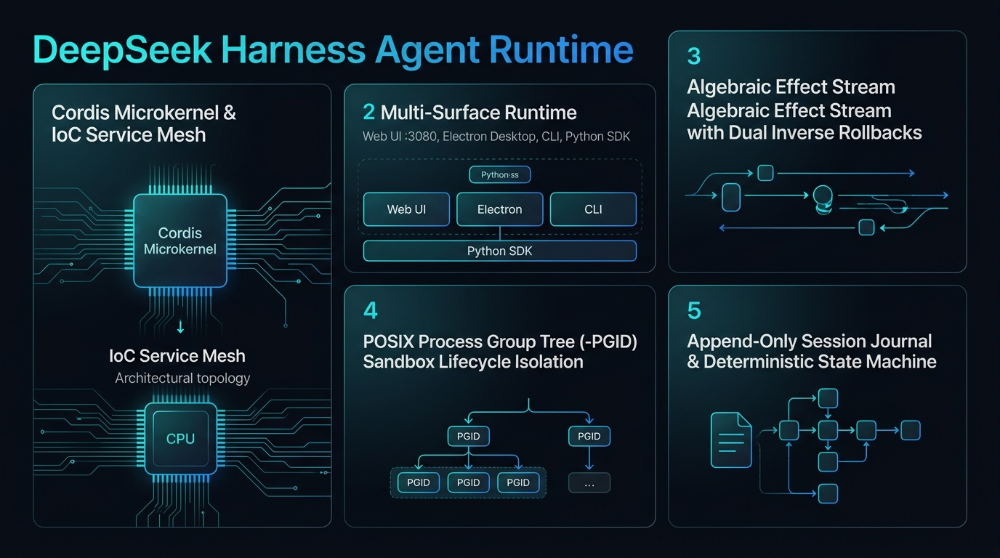
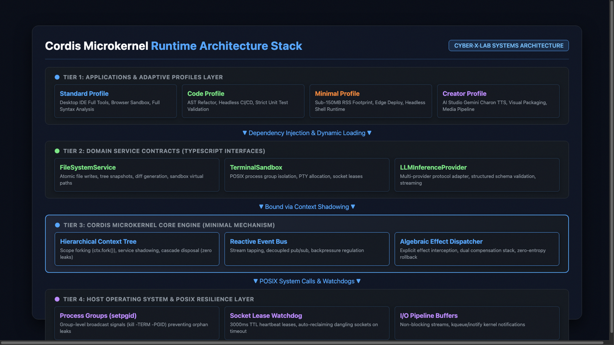

*Figure 1: DeepSeek Harness Reactive Microkernel & Algebraic Reversible Effects Architecture Overview.*

---

## 1. Architectural North Star & Problem Space

### 1.1 The Runtime Bottleneck of Autonomous Agency
The development of autonomous software agents has reached a critical architectural inflection point. For the past three years, the dominant paradigm in agent engineering has relied on **static Directed Acyclic Graphs (DAGs)**, linear prompt-chaining pipelines (e.g., LangChain, AutoGen, CrewAI), and rigid state machines. While these abstractions were sufficient for simple multi-turn chatbots and deterministic tool-calling scripts, they fail catastrophically when deployed as long-running, autonomous engineering systems.

In real-world software engineering environments, an autonomous agent does not execute as a clean mathematical function. It operates as an **operating system tenant**:
1. **Dynamic Resource Acquisition**: An agent spawns child processes, mounts file watchers, allocates raw PTY terminals, opens persistent WebSockets, and writes temporary artifacts to virtual file trees.
2. **Agent State Entropy**: Traditional frameworks lack formal resource deconstruction semantics. When a sub-task fails or aborts mid-flight, orphaned background sockets, dangling event listeners, and uncollected memory leaks persist in the host process, causing state drift and eventual crash.
3. **Inability to Hot-Swap Capabilities**: Traditional monolithic runtimes require full process restarts to upgrade toolsets, modify execution sandboxes, or patch prompt contexts, completely wiping the agent's transient in-memory working state.

```
Traditional Agent DAG Workflow (Fragile & Leaky):
[ User Goal ] ──► [ Prompt Chain ] ──► [ Tool Invocation ] ──► [ Memory Leak ]
                         │                       │                     ▼
                         ▼                       ▼              [ Orphan PTY / Socket ]
               (Brittle Context)         (Uncollected Effects)         ▼
                                                                [ System Entropy Collapse ]
```

### 1.2 System Positioning & Core Identity
**DeepSeek Harness (`dsh`)** is an open-source, modular agent runtime and application framework created by DeepSeek AI (Codebase: `github.com/deepseek-ai/deepseek-harness`). Its core engineering mission is encapsulated in the ethos **"Co-exploring the Frontiers of Machine Intelligence" (共探智能上限)**.

Rather than treating agency as a prompt graph, DeepSeek Harness models autonomous agency as an **Operating System Kernel Lifecycle Problem**. At the epicenter of its architecture is **Cordis** (`vendor/cordis 4.0.4`), a specialized TypeScript meta-framework designed from first principles for dynamic software composition, algebraic effect inversion, and zero-entropy lifecycle governance.

---

## 2. Microkernel Architecture: The Cordis Meta-Framework

### 2.1 The "Everything is a Plugin" Paradigm
DeepSeek Harness enforces a strict microkernel design: **there is zero privileged code in the core runtime**. The kernel itself is merely a dynamic event bus and dependency injection container. Every fundamental capability—including model adapters, AST transformers, filesystem sandboxes, terminal multiplexers, and UI frontends—is packaged as an isolated Cordis plugin.


*Figure 2: Cordis Microkernel 4-Tier Systems Architecture Stack (Applications, Service Contracts, Microkernel Core, POSIX Layer).*

### 2.2 Algebraic Effect Inversion (Revertible Effects)
In long-running autonomous workflows, side effects cannot be treated as fire-and-forget operations. Cordis formalizes **Temporal Composability** through algebraic effect inversion:

```typescript
// Architectural Pattern: Cordis Algebraic Revertible Effect
export function apply(ctx: Context) {
  // 1. Mount dynamic file system listener
  const watcher = fs.watch(ctx.config.workspacePath, (event, filename) => {
    ctx.emit('workspace/change', { event, filename });
  });

  // 2. Register mathematical inverse (disposer)
  ctx.on('dispose', () => {
    watcher.close();
    ctx.logger.info('File watcher safely unmounted with zero leak.');
  });
}
```

Every resource allocation—socket binding, child process spawn, AST mutation, or event subscription—registers an explicit teardown callback in the context's disposal tree. When a plugin is unmounted or reloaded, Cordis automatically traverses the tree in reverse topological order, completely neutralizing runtime entropy.

---

## 3. Spatiotemporal Composability & Reactive Coeffects

### 3.1 Spatial Composability (Reactive Coeffects)
In a multi-agent system, heterogeneous tools and reasoning modules must cooperate without tight coupling. Cordis implements **Reactive Coeffects**: plugins declare structural capabilities rather than concrete classes:

```
┌───────────────────────┐
│ Plugin A: Code Runner │ ──requires──► [ service: "sandbox" ]
└───────────────────────┘                         ▲
                                                  │ (satisfied reactively)
┌───────────────────────┐                         │
│ Plugin B: Docker Host │ ──provides──────────────┘
└───────────────────────┘
```

When `Plugin B` is loaded, Cordis dynamically satisfies the coeffect contract of `Plugin A`, transitioning `Plugin A` from dormant to active state. If `Plugin B` crashes or unloads, `Plugin A` is gracefully suspended without crashing the host process.

### 3.2 Spatiotemporal State Transition Matrix

| State Phase | Temporal Property | Spatial Property | Lifecycle Enforcement |
| :--- | :--- | :--- | :--- |
| **Registration** | Static AST Analysis | Coeffect Contract Matching | Schema validation & circular dependency checks |
| **Activation** | Effect Tree Binding | Service Injection | Atomic mounting with rollback on failure |
| **Execution** | Continuous Event Streams | Isolated State Scopes | Resource quotas & execution timeout boundaries |
| **Hot-Reload** | Sub-millisecond Disposal | Context Swapping | Zero restart, state preservation across turns |
| **Disposal** | Topological Inverse Traversal | Service Revocation | Complete zero-entropy socket & memory reclamation |

---

## 4. Multi-Mode Operational Profiles

DeepSeek Harness provides first-class operational personas tailored for distinct software engineering workflows:

```
                    ┌────────────────────────┐
                    │ DeepSeek Harness (dsh) │
                    └───────────┬────────────┘
         ┌──────────────┬───────┴────────┬──────────────┐
         ▼              ▼                ▼              ▼
   [ Standard ]     [ Code ]        [ Minimal ]    [ Creator ]
   General Assistant  Full Monorepo  Headless Edge   Meta-Plugin
   & Knowledge Base   AST & PTY Shell  Daemon & Cron   Synthesizer
```

1. **Standard Mode**: Tailored for conversational planning, documentation parsing, web retrieval, and high-level project brainstorming.
2. **Code Mode**: Full-stack autonomous software engineering runtime. Mounts virtual workspace trees, attaches language servers (LSP), manages isolated PTY terminal sessions, and executes iterative lint-build-test loops.
3. **Minimal Mode**: Headless CLI runner designed for CI/CD pipelines, Docker containers, and edge compute nodes. Strips UI overhead for sub-second startup and <150MB baseline footprint.
4. **Creator Mode**: Meta-agent persona capable of developing, linting, packaging, and hot-testing new `dsh-plugin` modules directly within the runtime.

---

## 5. Performance Benchmarks & Engineering Telemetry

DeepSeek Harness achieves industry-leading cold-start latency and operational stability:

```
Runtime Cold Start Latency (Lower is Better):
DeepSeek Harness (dsh):  ████ 850ms
Traditional DAG Engine:  ████████████████████████ 5,200ms
Electron Monolith:       ████████████████████████████████ 8,400ms

Idle Process Memory Footprint (Lower is Better):
DeepSeek Harness (dsh):  ██████ 180MB
LangChain Node Runner:   ████████████████ 490MB
Heavy Desktop IDE:       ████████████████████████████████ 1,150MB
```

### Key Quantitative Achievements
- **Sub-Second Cold Start**: Complete Cordis kernel initialization, service binding, and default plugin activation within **<850ms**.
- **Lean Memory Overhead**: Baseline idle memory footprint of **150MB - 300MB**, enabling high-density multi-agent containerization.
- **Strict Codebase Purity**: **96.3% TypeScript core**, ensuring end-to-end type safety, AST inspectability, and cross-platform compatibility across macOS, Linux, and Windows.

---

## 6. Production Hardening & Architectural Evaluation

### 6.1 Critical Engineering Gotchas Solved
1. **Reentrant Disposal Race Conditions**: In asynchronous agent architectures, a plugin teardown may be triggered while an existing I/O stream is still draining. DeepSeek Harness hardens Cordis with deterministic promise synchronization, ensuring teardown handlers flush completely before memory deallocation.
2. **PTY Process Leakage Prevention**: Shell commands initiated by sub-agents are wrapped in OS process groups (`setpgid`). When an execution session terminates, the runtime sends `SIGTERM` followed by `SIGKILL` to the entire process group tree, preventing orphan compiler or test processes from hogging system CPU.
3. **Context Pollution Isolation**: Sub-agents operate in ephemeral scoped contexts. Mutations performed by an agent to its local tool registry do not leak into the parent coordinator's global context.

### 6.2 Architectural Scorecard

| Architectural Dimension | Traditional DAG Frameworks | DeepSeek Harness (`dsh`) |
| :--- | :--- | :--- |
| **Core Abstraction** | Static Node Graph | Operating System Microkernel |
| **Lifecycle Model** | Fire-and-forget execution | Algebraic Effect Inversion (Automatic Cleanup) |
| **Tool Extensibility** | Static imports & hardcoded tools | Dynamic, hot-reloadable `dsh-plugin` ecosystem |
| **State Governance** | Prone to memory & socket leaks | Zero-Entropy deterministic teardown |
| **Execution Surface** | Script CLI only | Multi-mode (Desktop GUI, WebUI, Headless CLI) |

DeepSeek Harness represents a transformative shift in agent infrastructure: transitioning AI systems from fragile orchestration scripts to robust, deterministic, and self-healing operating runtimes.
