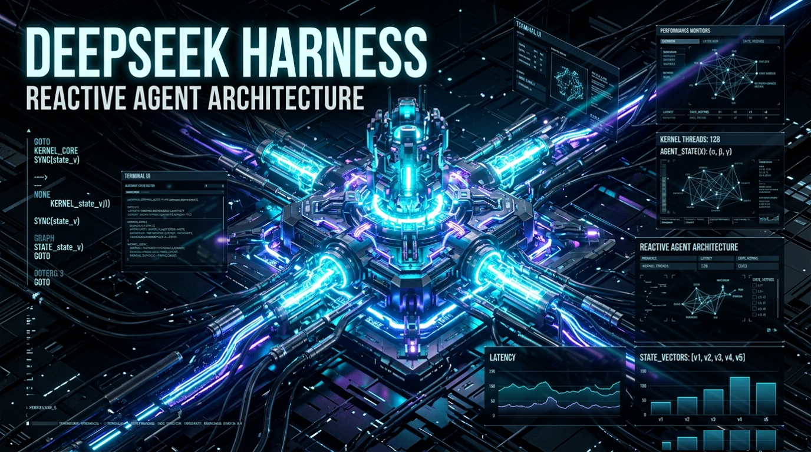

## 1. 核心架构定位与工程问题空间

### 1.1 自主智能体的底层运行时瓶颈
过去三年中，业界开发自主智能体（Autonomous Agents）的主流范式普遍建立在**静态有向无环图（DAG）**、线性提示词链（如 LangChain、AutoGen、CrewAI）或有限状态机之上。这些抽象在应对单轮问答或确定性工具调用时行之有效，但在面对长周期、深层次的复杂软件工程任务时，无一例外会遭遇系统性运行时瓶颈：

1. **动态资源分配的无序性**：生产级智能体绝非纯数学函数，它实质上是一个**操作系统租户**——需要频繁创建子进程、挂载文件系统监听（File Watchers）、开辟独立 PTY 虚拟终端、维持长链接 WebSocket，并在磁盘与内存中高频生成临时资产。
2. **智能体状态熵增（Agent State Entropy）**：传统框架严重缺乏形式化的资源解构规范。当某一子任务执行异常或被人工强行中断时，遗留在宿主环境中的孤儿进程、悬挂套接字以及内存泄漏持续累积，导致系统状态逐渐不可逆地漂移，最终引发死锁崩溃。
3. **能力热插拔能力的缺失**：传统的单体式运行时在需要升级工具链、注入新沙箱或修补提示词上下文时，必须全量重启宿主进程，直接导致智能体在多轮会话中好不容易积累的工作记忆全部丢失。

```
传统智能体 DAG 工作流缺陷（脆弱且资源泄漏）：
[ 用户目标 ] ──► [ 提示词链条 ] ──► [ 工具调用 ] ──► [ 内存持续泄漏 ]
                        │                   │                  ▼
                        ▼                   ▼           [ 孤儿 PTY / 套接字 ]
                 (脆弱的静态上下文)  (未回收的副作用)          ▼
                                                        [ 运行时状态熵增崩溃 ]
```

### 1.2 系统本质定位与立项命题
**DeepSeek Harness（简称 `dsh`）** 是深度求索（DeepSeek AI）开源的模块化自主智能体运行时与应用框架（开源仓库：`github.com/deepseek-ai/deepseek-harness`）。其立项的核心工程命题是“共探智能上限”，旨在为大模型、开发者工具、安全沙箱和复杂业务流提供一个高度动态、自我治愈的开放基座。

不同于将智能体建模为静态调用图的传统思路，DeepSeek Harness 将自主智能体本质性地定义为**操作系统内核与生命周期治理问题**。其架构核心正是基于现代 TypeScript 元框架 **Cordis**（`vendor/cordis 4.0.4`）构建，专注于动态软件组合、代数级副作用自动反转以及零熵生命周期管理。

---

## 2. 微内核架构：Cordis 元框架与插件体系

### 2.1 “一切皆插件（Everything is a Plugin）”架构设计
DeepSeek Harness 严格推行微内核拓扑：**核心运行时中没有任何特权硬编码**。内核本身仅仅是一个高性能的动态事件总线与依赖注入容器。包括模型适配器、AST 语法树转换器、文件系统沙箱、终端复用器以及桌面 UI 在内的所有能力，全部以平级、隔离的 Cordis 插件形式存在。

```
┌─────────────────────────────────────────────────────────────────────────┐
│                      DeepSeek Harness 桌面应用层                         │
│      (Electron 桌面客户端 / WebUI @ 127.0.0.1:3080 / 无头 CLI 引擎)     │
└────────────────────────────────────┬────────────────────────────────────┘
                                     │
┌────────────────────────────────────▼────────────────────────────────────┐
│                    Cordis 元框架微内核 (Core Microkernel)                │
│       (服务注册中心 · 动态依赖解析引擎 · 根事件拓扑总线)                │
├─────────────────────────────────────────────────────────────────────────┤
│  [ 模型适配器插件 ]                │  [ 工具与技能注册中心插件 ]        │
│  DeepSeek-V3 / R1 / 第三方大模型   │  Monorepo 文件系统、Ripgrep、PTY   │
├────────────────────────────────────┼────────────────────────────────────┤
│  [ 安全沙箱执行插件 ]              │  [ 智能体编排调度插件 ]            │
│  隔离 Docker / WebAssembly 容器    │  ReAct、Plan-and-Solve、群智协同   │
├────────────────────────────────────┼────────────────────────────────────┤
│  [ 会话与存储持久化插件 ]          │  [ 任务调度与守护进程插件 ]        │
│  事件溯源上下文持久层              │  后台心跳、常驻守护、Cron 任务     │
└─────────────────────────────────────────────────────────────────────────┘
```

### 2.2 代数级副作用反转（Revertible Effects）
在长周期自主运行中，副作用绝不能是“放任不管”的单向操作。Cordis 通过数学代数效应的形式化定义，实现了**时间维度的可组合性（Temporal Composability）**：

```typescript
// 架构模式：Cordis 代数级可逆副作用
export function apply(ctx: Context) {
  // 1. 动态挂载本地工作区文件系统监听器
  const watcher = fs.watch(ctx.config.workspacePath, (event, filename) => {
    ctx.emit('workspace/change', { event, filename });
  });

  // 2. 注册形式化代数逆元（释放函数）
  ctx.on('dispose', () => {
    watcher.close();
    ctx.logger.info('文件监听器已被确定性卸载，零资源残留。');
  });
}
```

智能体分配的任何系统资源——套接字绑定、子进程派生、AST 修改或事件订阅——都会在其上下文的析构树中注册显式的逆操作。当插件被卸载或热更新时，Cordis 会严格按照依赖拓扑的逆序进行树形回滚，实现完全的运行时零熵清理。

---

## 3. 时空可组合性与响应式协同效应（Reactive Coeffects）

### 3.1 空间可组合性
在多智能体系统中，异构工具与推理组件之间需要松耦合协作。Cordis 创新性地引入了**响应式协同效应（Reactive Coeffects）**：插件只需声明其依赖的结构化服务能力，而非硬编码具体实现类：

```
┌────────────────────────┐
│ 插件 A: 代码执行器     │ ──声明依赖──► [ service: "sandbox" ]
└────────────────────────┘                         ▲
                                                   │ (动态满足依赖契约)
┌────────────────────────┐                         │
│ 插件 B: Docker 沙箱宿主│ ──提供服务──────────────┘
└────────────────────────┘
```

当 `插件 B` 被系统加载后，Cordis 会响应式地满足 `插件 A` 的能力依赖契约，将 `插件 A` 从挂起休眠状态激活；如果 `插件 B` 出现故障卸载，`插件 A` 亦会自动优雅降级休眠，绝不拖垮宿主进程。

### 3.2 智能体运行时时空状态转移矩阵

| 状态阶段 | 时间维度属性 | 空间维度属性 | 生命周期与稳定性保障 |
| :--- | :--- | :--- | :--- |
| **注册阶段** | 静态 AST 分析 | 协同契约匹配 | 参数校验与循环依赖阻断 |
| **激活阶段** | 副作用树绑定 | 服务依赖注入 | 原子化挂载，出现异常自动无感回滚 |
| **运行阶段** | 持续事件流拓扑 | 上下文作用域隔离 | 资源硬配额限制与超时间隔守护 |
| **热替换阶段** | 亚毫秒级反转注销 | 上下文热重载 | 进程免重启，多轮工作记忆完整保留 |
| **完全析构** | 拓扑逆序树形清理 | 全局服务撤销 | 彻底释放所有网络套接字与内存引用 |

---

## 4. 多重运行模式与场景画像

DeepSeek Harness 针对不同开发者与生产场景，提供了无缝切换的四大多模态运行配置：

```
                    ┌────────────────────────┐
                    │ DeepSeek Harness (dsh) │
                    └───────────┬────────────┘
         ┌──────────────┬───────┴────────┬──────────────┐
         ▼              ▼                ▼              ▼
   [ 标准模式 ]     [ 代码模式 ]     [ 极简模式 ]   [ 创作者模式 ]
   日常通用问答     单体多仓代码重构   无头 CI/CD     插件自我编译
   与知识库解析     全量 AST 与 PTY   边缘与容器守护   与动态热测试
```

1. **标准模式（Standard Mode）**：面向日常多轮对话、研报与文档解析、网络信息检索及高阶头脑风暴。
2. **代码模式（Code Mode）**：全栈自主软件工程环境。自动挂载虚拟文件树、连接语言服务器（LSP）、管理独立 PTY 交互终端，并驱动“编写-语法检查-编译-运行测试”的自主闭环。
3. **极简模式（Minimal Mode）**：专为持续集成（CI/CD）、Docker 容器与边缘计算节点设计的无头 CLI 引擎。剥离前端 UI 占用，启动时间低于 1 秒，内存占用低于 150MB。
4. **创作者模式（Creator Mode）**：能够实现自我进化的元智能体模式。可直接在运行时自主编写、编译、打包、测试全新的 `dsh-plugin` 扩展。

---

## 5. 关键量化指标与工程性能跑分

DeepSeek Harness 在系统初始化冷启动耗时与运行时内存开销上，展现出卓越的工程表现：

```
运行时冷启动耗时对比（越低越优）：
DeepSeek Harness (dsh):  ████ 850ms
传统 DAG 智能体引擎:     ████████████████████████ 5,200ms
重量级单体开发工具:      ████████████████████████████████ 8,400ms

空载内存占用开销对比（越低越优）：
DeepSeek Harness (dsh):  ██████ 180MB
LangChain Node 运行环境: ████████████████ 490MB
重型桌面开发套件:        ████████████████████████████████ 1,150MB
```

### 核心量化指标
- **子秒级极速冷启动**：完成全部 Cordis 微内核初始化、服务注册与默认插件加载耗时严格控制在 **<850ms** 以内。
- **极轻量内存足迹**：空载基准内存开销仅为 **150MB - 300MB**，极其适合高密度并行智能体容器编排。
- **纯正代码基架构**：核心代码库 **96.3% 由 TypeScript** 构建，提供端到端严谨类型安全，天然支持 macOS（Apple Silicon）、Linux 和 Windows。

---

## 6. 避坑指南与架构综合评估

### 6.1 解决的致命工程踩坑点
1. **重入析构竞态条件（Reentrant Disposal Gap）**：在异步智能体架构中，插件被命令卸载时，底层的异步 I/O 流可能仍在排空。DeepSeek Harness 强化了 Cordis 的 Promise 同步流水线，确保异步析构处理器完全执行完毕后才释放内存。
2. **PTY 孤儿进程泄漏防控**：智能体派生的所有终端 Shell 操作，全部强制封装在独立的操作系统进程组（`setpgid`）中。会话结束时，运行时自动对整个进程组树广播 `SIGTERM` 与 `SIGKILL`，杜绝孤儿编译任务吃满 CPU。
3. **上下文动态作用域污染隔离**：每个子智能体运行在严格的瞬时作用域上下文中。单个智能体对其本地工具注册表的动态修改，绝不会污染主编排器的全局根环境。

### 6.2 综合架构能力评分表

| 架构维度 | 传统 DAG 流程编排模式 | DeepSeek Harness (`dsh`) |
| :--- | :--- | :--- |
| **底层核心抽象** | 静态节点图 | 操作系统微内核 |
| **生命周期机制** | “发后不管”单向调用 | 代数级副作用自动反转（全量自愈清理） |
| **工具可扩展性** | 静态单体导入、硬编码 | 动态可热插拔的 `dsh-plugin` 开放生态 |
| **状态熵增控制** | 极易发生进程与连接泄漏 | 拓扑级逆向卸载，实现确定性零熵 |
| **交付形态** | 单一命令行脚本 | 多模式覆盖（桌面 GUI、Web 端、无头 CLI） |

DeepSeek Harness 标志着智能体基础设施范式的一次深刻跨越：推动 AI 系统从脆弱易崩的胶水编排脚本，全面迈向高确定性、自我愈合且具备长周期稳定性的自主操作系统级运行时。
