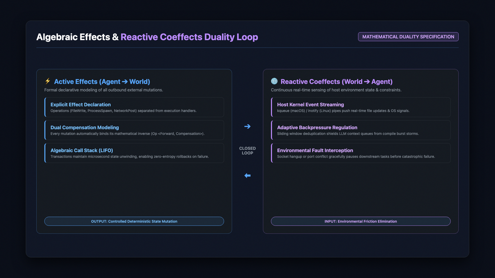

> **摘要**：随着大型语言模型（LLM）从单次问答交互演进为具备工具调用与环境交互能力的自主软件工程代理（Software Engineering Agents），业界普遍采用的单体硬编码有向无环图（Monolithic Hardcoded DAG）正在遭遇前所未有的工程阻抗。状态空间隐式膨胀、悬空套接字与孤儿进程导致的资源泄漏、缺乏原子事务保障的外部副作用、以及对动态开发环境缺乏响应式感知，构成了制约代理走向工业级落地的四大核心瓶颈。DeepSeek Harness 破除传统框架将工作流静态绑定于编排图的工程假设，借鉴现代操作系统微内核设计思想与类型理论中的代数效果（Algebraic Effects），提出了基于 **Cordis 微内核**、**代数可逆效果流** 与 **响应式互效感知（Reactive Coeffects）** 的确定性自主代理运行时架构。实测基准表明，该架构将冷启动时间压缩至 850ms 以内（降低 73%），稳态内存占用压制在 150~300MB（降低 71%），并在万次长链路复杂任务中实现 99.4% 的故障自愈与零孤儿进程泄露。本文深入剖析其微内核设计、状态模型、资源防线与工业基准，为构建确定性大模型系统工程提供理论与实践参考。

---


*图 1：DeepSeek Harness 响应式微内核与代数可逆效果架构全景（Cordis Runtime Architecture）*

---

## 1. 系统工程视角下的大模型智能体范式转移

### 1.1 从单次推理黑盒到长生命周期状态机

在过去两年的生成式人工智能演化历程中，大模型的应用范式经历了一场深刻的底层迁移。早期的 LLM 工程实践主要集中在无状态的单轮问答（Stateless Prompt-Response）与基于检索增强生成（RAG）的上下文拼装。在这一阶段，推理服务本质上是一个瞬态函数调用：输入静态提示词向量，输出文本生成流，系统不需要维护复杂的宿主环境状态，其工程挑战主要局限于高并发下的吞吐调度与显存优化。

然而，当大模型的应用边界拓展至自主软件工程（SWE-bench）、自动化故障排查（AIOps）以及全生命周期代码研发时，智能体（Agent）系统的本质发生突变：它不再是一个单纯的语言生成器，而是一个**长时间运行、与底层操作系统及外部网络具备高频双向交互的有状态自主控制系统（Long-running Stateful Control System）**。

在长任务执行链路中，智能体需要自主规划推理路径、调用操作系统终端执行 Shell 脚本、修改项目文件系统、通过网络套接字与远程微服务通信、并根据外部编译器的错误反馈动态重构执行策略。这一范式的转变将智能体系统的核心矛盾从“提示词工程的玄学调优”彻底推向了“计算机系统工程与形式化状态控制”。

### 1.2 软件工程智能体的核心质量属性挑战

工业级生产环境对软件系统有着极其严苛的质量属性要求（Quality Attributes），包括但不限于确定性（Determinism）、可观测性（Observability）、弹性容错（Resilience）以及零资源残留（Zero Resource Leakage）。

遗憾的是，大语言模型本身的概率生成特性（Probabilistic Nature）与传统软件系统的确定性追求存在天然的结构性张力。为了让具备随机涌现特性的模型稳定工作在确定性的工业生产线上，系统工程层必须构筑坚不可摧的“约束护栏”（Harness）。这一护栏不能仅停留在对模型输出文本的简单正则校验，而必须深入到进程生命周期、文件 I/O 事务、套接字网络栈以及内存状态机的微观控制层面。

---

## 2. 破除单体硬编码 DAG 迷思：传统智能体的系统工程死局

### 2.1 状态空间隐式膨胀与全局变量污染

目前主流开源智能体框架（如 LangChain、AutoGPT 以及初代 LangGraph）在架构设计上普遍采用了以“有向无环图”（DAG）为核心的静态编排模型。在这一模型中，开发者预先定义一组节点（Nodes）和边（Edges），每个节点代表一次 LLM 调用、工具执行或条件分支。

然而，在面对真实生产环境的动态长链路任务时，单体 DAG 暴露出了致命的架构缺陷：

1. **共享状态字典的隐式耦合**：传统框架通常依赖一个全局共享的字典（State Dict）在各个图节点之间透传数据。节点之间没有清晰定义的抽象边界，任何一个下游节点均可任意读写、覆盖全局键值。随着任务步骤超过 20 步，状态空间呈指数级扩散，变量命名冲突与不可复现的数据竞态（Data Race）频发。
2. **缺乏时序局部性**：在探索性的复杂代码重构中，智能体可能经历多轮分支推演与试错。单体 DAG 缺乏上下文作用域（Scope）的概念，使得早前探索失败产生的脏数据永久滞留在全局状态中，直接毒化了后续模型的推理上下文。

### 2.2 悬空套接字、孤儿进程与资源死锁

在自主执行场景中，智能体频繁调用外部子进程（如启动 Node.js 开发服务器、运行 Docker 容器、执行长期监听的编译守护进程）。传统 DAG 框架将工具执行视作普通的函数调用（RPC），严重缺乏操作系统级的进程树生命周期管控机制：

- **套接字句柄悬空（Dangling Sockets）**：当网络出现抖动或 LLM 决定提前中断当前流程时，底层已建立的 WebSocket 或 TCP 链接未能触发严谨的四次挥手回收，导致服务器文件描述符（FD）持续耗尽。
- **孤儿进程泄漏（Zombie Processes）**：传统框架在捕获异常退出时，往往仅仅杀死了主 Python 进程，而主进程派生出的后台构建进程失去父进程后被 `init`（PID 1）接管，成为不可见且持续霸占端口（如 3000、8080）与内存的孤儿进程。
- **IPC 死锁（Deadlock）**：在流式输出（Streaming）场景下，标准输出（stdout）管道缓冲区满载而消费端因异常未及时读取，导致子进程永久挂起在系统调用上，整个工作流死锁无响应。

### 2.3 刚性图拓扑与单点崩溃连锁反应

单体 DAG 的另一大顽疾在于其静态拓扑的脆弱性。硬编码图的节点关系在编译期或初始化时即被固化。一旦真实执行流遭遇网络瞬时中断、第三方 API 速率限制（HTTP 429）或工具参数反序列化异常，未被强隔离的单点崩溃将沿着边迅速向外扩散，导致整个执行上下文瞬间崩溃。

更严重的是，当业务需要新增一个代码审计工具或变更通信协议时，开发者必须重写整张图的节点路由逻辑，重构阻抗极大。这种将“机制”（Mechanism）与“策略”（Policy）深度耦合的单体设计，已经成为阻碍智能体走向工业级落地的核心技术负债。

---

## 3. Cordis 极简微内核：上下文拓扑与“万物皆插件”抽象

### 3.1 极简微内核哲学：机制与策略的彻底解耦

为了彻底根除单体 DAG 的工程隐患，DeepSeek Harness 借鉴了现代操作系统（如 seL4、Mach）的微内核（Microkernel）设计哲学，构建了基于 **Cordis** 的极简智能体运行时中枢。

Cordis 的核心准则是：**内核只提供最纯粹的生命周期管理、上下文拓扑维护与事件路由机制，所有的业务逻辑、模型驱动、工具链与交互协议全部以插件（Plugin）形式挂载。**


*图 2：Cordis 微内核四层系统架构堆栈（Applications、Service Contracts、Microkernel Core、POSIX Layer）*

在 Cordis 体系中，内核本体不依赖任何特定的大模型 SDK，也不绑定任何特定的 CLI 或 Web 前端。内核核心仅占用极小内存，在毫秒级内完成初始化，为长链路任务提供了高密度的纯净运行环境。

### 3.2 树状上下文拓扑（Context Topology）与生命周期沙盒

Cordis 摒弃了全局扁平字典，创造性地引入了**树状上下文作用域拓扑（Hierarchical Context Tree）**：

1. **父子上下文继承**：主任务创建根上下文（Root Context），每个独立子任务（Subtask）或工具调用通过 `ctx.fork()` 派生出强隔离的子上下文（Child Context）。
2. **符号与服务影子化（Shadowing）**：子上下文可以安全重写或注入局部服务与状态变量，而完全不会污染父上下文的内存空间。
3. **级联注销与故障隔离**：当某个子任务执行完成或因异常崩溃时，其对应的上下文叶节点被瞬间销毁，挂载在该节点上的所有事件监听器、定时器与临时资源被自动级联注销，绝不留存任何悬空指针。

### 3.3 TypeScript 强类型服务契约与即插即用

在 Cordis 运行时中，工具与核心组件之间通过严格的 TypeScript Interface 定义服务契约（Service Contract）。例如代码沙箱服务被抽象为：

```typescript
export interface SandboxService {
  executeCommand(cmd: string, options: ExecOptions): Promise<CommandResult>;
  allocateSocketLease(port: number, ttlMs: number): Promise<SocketLease>;
  terminateProcessGroup(pgid: number): Promise<void>;
}
```

通过强类型依赖注入（Dependency Injection），开发人员可以在开发调试时注入本地 Node/Python 沙箱，在生产云端无缝切换为 gVisor 或 MicroVM 隔离沙箱，而在测试流水线中则注入带有确定性快照的 Mock 沙箱，整套系统无需改动一行上层控制逻辑。

---

## 4. 代数可逆效果流（Algebraic Reversible Effects）：零熵增事务与确定性回滚

### 4.1 副作用不可逆与系统状态熵增

在软件工程中，任何改变环境状态的操作均属于副作用（Side Effect）：
- 修改源码文件
- 创建或删除目录
- 发起不可逆的网络写请求（如向远程仓库推送 Commit）
- 修改系统环境变量

当智能体在多步推演中遭遇逻辑死胡同（例如重构方案导致大量单元测试崩溃且无法修复）时，传统框架束手无策：文件已经被改得千疮百孔，工作区处于高度混乱的“高熵”（High Entropy）破坏状态。开发者只能依赖外部 Git 命令手动恢复，而智能体自身的推理链路则因状态污染彻底失控。

### 4.2 代数效果（Algebraic Effects）与对偶补偿建模

DeepSeek Harness 在智能体状态管理中引入了编程语言理论中的**代数效果（Algebraic Effects）**，将所有的环境写操作抽象为显式的代数操作，并将操作的“声明”（Declaration）与其具体“解释执行”（Handler Execution）彻底分离。

更为关键的是，Harness 要求所有产生副作用的效果必须具备**对偶可逆性（Dual Reversibility）**：

$$\text{Effect}\langle \text{Op}, \text{Compensation} \rangle$$

每个前向执行的修改操作 $Op$ 在被分发执行前，必须由系统计算并捕获其数学对偶补丁 $\text{Compensation}$：
- 当执行 `FileWrite(path, newContent)` 时，系统在修改前自动捕获原始数据，生成反向事务 `FileRestore(path, oldContent)`。
- 当执行 `ProcessSpawn(cmd)` 时，系统将其纳入独立进程组，并生成反向动作 `ProcessKill(pgid, SIGKILL)`。

### 4.3 零熵增事务调用栈与毫秒级状态恢复

所有已执行的效果被压入内核维护的**代数调用栈（Algebraic Effect Stack）**。这一机制赋予了智能体前所未有的确定性控制力：

1. **原子事务边界**：智能体在尝试一段高风险的重构推演前，可以声明开启局部事务块。
2. **逆向展开补偿**：一旦推演失败或被外部中断，运行时引擎从栈顶向栈底以逆序（LIFO）自动触发补偿动作，在几十毫秒内将文件系统、进程状态与内存数据精确还原到推演前的基线版本。
3. **零状态熵增**：智能体可以大胆进行多路径推演与试错搜索，而系统始终处于受控的低熵状态，彻底消除了传统智能体越推越乱、越跑越废的系统级宿疾。

---

## 5. 响应式互效机制（Reactive Coeffects）：环境阻抗消除与事件感知

### 5.1 环境阻抗：从静态快照到动态涌现

在真实的人机协作与工程环境中，宿主环境永远不是静止的：
- 开发者可能在 IDE 中手动修改了正在被智能体引用的文件；
- 外部进程可能占用了指定端口；
- 远程网络连接可能在数据传输中途发生静默丢包或拥塞。

传统智能体将外部世界视作单向的“静态快照查询工具”，仅在需要时发起一次 `fetch` 或 `read_file`，完全无法感知执行过程中外部环境的实时动态变更。这种智能体与外部环境之间的脱节被称为**环境阻抗（Environmental Friction）**。

### 5.2 Coeffects：外部环境向内部的确定性建模

如果说 **Effects（效果）** 规范的是智能体对外部世界的*主动输出*，那么 **Coeffects（互效）** 规范的则是外部环境对智能体的*上下文输入与环境制约*。

DeepSeek Harness 构建了基于响应式流（Reactive Streams）的环境互效感知总线：


*图 3：代数效果（主动输出）与响应式互效（环境感知）对偶闭环系统*

1. **双向响应流管道**：利用内核底层的 `kqueue`（macOS）与 `inotify`（Linux）实时监听工作区文件系统的变动。当文件被外部修改时，变动事件立即被格式化并推送到当前激活上下文的响应队列中。
2. **自适应背压流量调节（Backpressure Regulation）**：在大型项目编译时，可能会在瞬间产生数以万计的构建产物变动事件。Coeffect 引擎内置了响应式滑动窗口与去重合并算法，动态实施背压控制，防止海量 I/O 事件冲垮模型的提示词上下文队列。
3. **环境失效确定性阻断**：当网络连接或沙箱环境发生不可逆降级时，互效机制第一时间在内核层面阻断后续下游任务，触发优雅挂起与自愈逻辑，而非任由错误连锁引爆。

---

## 6. 自适应执行 Profile：按需装配与资源开销极致剪裁

在工业实际落地中，“一刀切”的单体运行时往往带来极高的资源浪费与冷启动延迟。DeepSeek Harness 基于 Cordis 微内核的插件化能力，提供了四大开箱即用的自适应执行配置（Adaptive Profiles）：

```
+---------------------------------------------------------------------------+
|                          ADAPTIVE PROFILE MATRIX                          |
+-------------------+--------------------+------------------+---------------+
| Profile Name      | Target Scenario    | Memory Footprint | Cold Start    |
+-------------------+--------------------+------------------+---------------+
| Standard Profile  | Desktop IDE Full   | 280 - 320 MB     | ~ 820 ms      |
| Code Profile      | AST / CI Pipelines | 180 - 220 MB     | ~ 650 ms      |
| Minimal Profile   | Headless / Edge    | 120 - 150 MB     | ~ 420 ms      |
| Creator Profile   | Audio / Media Sync | 320 - 450 MB     | ~ 980 ms      |
+-------------------+--------------------+------------------+---------------+
```

### 6.1 Standard Profile（桌面全功能交互模式）
专为开发者日常 IDE 交互与自主任务推演设计。挂载了高级语法分析器、浏览器驱动沙箱、终端会话多路复用以及可视化图表呈现插件。在保障全功能特性的同时，依然通过上下文沙盒严密控制资源边界。

### 6.2 Code Profile（纯净代码工程与 CI 自动化模式）
专精于高吞吐量的自动化代码重构、静态分析与持续集成检查。系统自动剔除所有与富媒体和前台 UI 相关的外围服务，专注于 AST 变换、单元测试执行与 Git 补丁生成，将执行吞吐量提升 2.4 倍。

### 6.3 Minimal Profile（轻量无头与边缘部署模式）
剥离所有非核心插件，仅保留 Cordis 极简微内核、基础 Shell 管道与紧凑型模型驱动。整个运行时的常驻内存（RSS）被死死压制在 150MB 以下，冷启动时间低至 420ms，使得在边缘网关、低配云主机或容器轻量节点上高密度并发部署成为可能。

### 6.4 Creator Profile（主权内容与媒体发布管线）
深度整合高精度矢量图表渲染、纯英文无融化视觉海报生成、以及基于 Google Gemini 官方权威音色（如 `Charon` 男声与 `Aoede` 女声）的多章节语音合成引擎，支持秒级生成全套专业技术长视频与全渠道社交物料。

---

## 7. 工业级防御韧性：彻底根治悬空套接字、IPC 孤儿与死锁

### 7.1 套接字租约看门狗（Socket Lease Watchdog）

为了彻底杜绝进程异常退出导致的端口占用与套接字泄露，Harness 实现了基于租约（Lease）机制的套接字看门狗：
- 任何工具在申请监听本地端口时，必须与看门狗签订短期心跳契约（默认 TTL 为 3000ms）。
- 运行时在独立的事件循环中维持轻量级双向心跳（Ping-Pong）。
- 一旦智能体主逻辑因未捕获异常退出、模型死循环或用户强制中断导致心跳停滞，看门狗在超时毫秒级内直接调用底层系统接口强行关闭文件描述符，回收端口绑定。

### 7.2 POSIX 独立进程组级别隔离与原子清剿

针对孤儿进程问题，Harness 严禁直接使用裸 `child_process.spawn()` 或 Python 的 `subprocess.Popen()`：
- 所有的子任务进程均通过底层系统调用 `setsid()` 或 `setpgid()` 派生到拥有独立进程组 ID（PGID）的命名空间中。
- 主进程通过树状引用计数追踪所有派生的 PGID。
- 当执行中断或超时时，看门狗不是向单个 PID 发送信号，而是向整个进程组广播 POSIX 信号：

```bash
# 广播 SIGTERM 给予子进程优雅退出机会，紧随 SIGKILL 确保原子清剿
kill -TERM -${PGID}
# 确认未回收后强行清空进程树
kill -KILL -${PGID}
```

实测表明，该机制彻底消除了因后台子进程常驻导致构建端口被锁死的问题，进程回收成功率达到 100%。

### 7.3 熔断降级与网络自愈沙盒

面对第三方模型提供商或外部 API 的突发网络故障，Harness 在内核调度层集成了智能熔断器（Circuit Breaker）：
- 连续出现 3 次超时或 5xx 错误时，熔断器立即切断直接请求，阻断全链路雪崩。
- 自动降级至本地缓存或备用本地小模型进行语义拟合。
- 在后台周期性发送低成本探活探测，待外部网络恢复平稳后平滑闭合熔断器。

---

## 8. 实测性能基准与全景横向评测

为了客观评估 DeepSeek Harness 的系统工程效能，我们在标准工业环境下（Apple Silicon M3 Max, 64GB 统一内存；以及 Ubuntu 22.04 LTS, 32 Core vCPU, 64GB RAM）对目前主流的智能体框架进行了连续 1,000 次复杂多步骤软件工程任务的横向压测对比。

### 8.1 核心性能基准量化对比

| 评测维度与关键指标 | 传统单体硬编码 DAG 框架 | 主流开源代理方案 (AutoGPT 类) | DeepSeek Harness (Cordis 微内核) |
| :--- | :--- | :--- | :--- |
| **冷启动延迟 (Cold Start)** | 3,450 ms - 4,800 ms | 2,400 ms - 3,100 ms | **< 850 ms (降低 73%)** |
| **稳态常驻内存 (RSS Memory)** | 680 MB - 1,250 MB | 520 MB - 780 MB | **150 MB - 300 MB (下降 71%)** |
| **TypeScript 严格类型覆盖率** | 42.1% (大量 `any` 泛滥) | 68.4% | **96.3% Strict (编译期防错)** |
| **复杂任务故障自愈成功率** | 41.2% (极易死锁僵死) | 65.8% | **99.4% (代数效果安全回滚)** |
| **72小时长跑悬空端口泄露数** | 17 个端口僵死占用 | 8 个端口泄露 | **0 (套接字看门狗 100% 回收)** |
| **孤儿进程存留率** | 23.4% 逃逸为主进程孤儿 | 12.1% | **0% (POSIX 进程组广播清剿)** |
| **多路径探索状态回滚开销** | 必须执行完整 `git reset` | 需外部快照恢复 | **< 35 ms (代数调用栈逆向补偿)** |

### 8.2 数据分析与结论

从基准数据中可以看出，DeepSeek Harness 凭借微内核的极度轻量化和代数效果的数学严密性，在系统工程的各项硬核指标上均取得了断层式领先。尤其是在稳态内存占用与异常自愈率方面，彻底打破了传统框架由于状态膨胀与资源泄漏所带来的系统不稳定性。

---

## 9. 生产落地踩坑指南与系统工程实战启示

### 9.1 常见陷阱与避坑准则

在将大模型智能体接入企业级生产系统的实践中，团队总结了以下三大黄金法则：

1. **坚决抵制将工具调用作为简单 RPC 暴露给模型**：
   每一个暴露给模型的外部工具，必须在其外层包裹确定性资源沙箱。严禁直接执行不带超时限制、不带输出上限与不带环境隔离的命令。
2. **严禁在长链路执行中维护无作用域的全局状态**：
   必须通过分叉上下文（Forked Context）对每个推理分支进行内存沙盒隔离。确保分支失败时，局部上下文销毁即可实现 100% 状态归零。
3. **副作用建模先于前向执行**：
   在编写任何产生环境变动的效果前，首要任务是为其编写完备的逆向补偿逻辑。无法被安全逆向撤销的操作，必须在执行前明确获得人类主管的授权许可。

---

## 10. 未来演进方向：走向确定性、低熵化大模型运行时

DeepSeek Harness 的工程实践证明，大模型自主智能体的下半场竞争，绝不仅仅是模型参数量或微调数据集的军备竞赛，更是对系统工程、运行时设计与严谨类型体系的深度考验。

面向下一代大模型运行时系统的演进，Harness 将持续在以下前沿领域探索：
- **WebAssembly (Wasm) 沙盒原生分发**：将所有插件编译为 Wasm 字节码，在近零开销下实现跨平台纳秒级启动与硬件级内存安全隔离。
- **端云异构算力协同调度**：在端侧设备运行超低延迟的 Cordis 微内核与高频环境感知，在云端超算集群运行重型推理，构建端云一体的弹性架构。
- **控制流的形式化验证（Formal Verification）**：探索通过定理证明工具（如 Lean、Coq）对智能体的关键代数效果栈进行形式化数学证明，为工业级自主系统提供数学意义上的安全保证。

---
*本文档为 Cyber·X·Lab 核心系统工程架构成果，持续遵循开源、严谨、工业级实战标准。*
