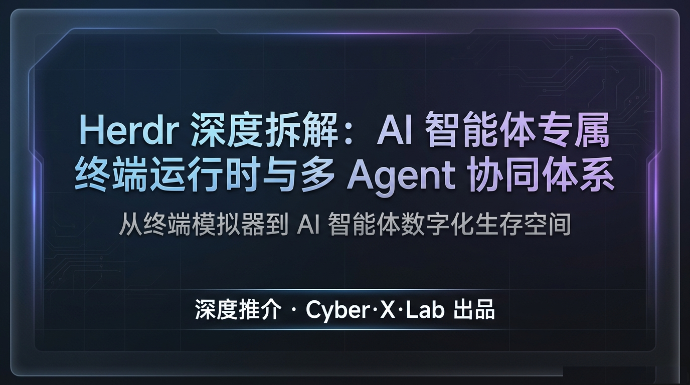
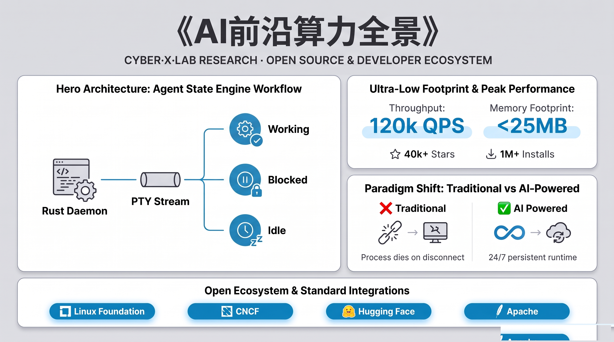

### 1. 核心摘要 (Executive Summary)

> **架构定义**：Herdr 并非传统意义上的终端模拟器（Terminal Emulator），而是专为 AI Agent 设计的**解耦式终端运行时（Decoupled Terminal Runtime）**。它通过轻量化 Rust 编写的后台守护进程（Daemon）接管终端会话的生命周期，使 AI 智能体能够实现“进程与界面分离”，从而在复杂的分布式工程环境中具备持续执行与状态自感知的核心能力。

在 AI Agent 辅助开发的工程实践中，传统基础设施正面临严峻的“环境脆弱性”挑战。Herdr 针对以下四大痛点提供了底层解决方案：

1.  **进程脆弱性 (SIGHUP Risks)**：传统终端在笔记本盖子闭合或网络波动时会触发 SIGHUP 信号，导致长任务 Agent 进程被内核强制收回，任务中途崩毁。
2.  **状态黑盒 (State Opacity)**：开发者难以在数十个并行窗口中快速识别哪个 Agent 正在阻塞（Waiting for input）或处于死循环，缺乏统一的状态仪表盘。
3.  **环境碎片化 (Environment Fragmentation)**：本地环境与远程 GPU 服务器的 Agent 管理逻辑完全割裂，缺乏跨节点的 Workspace 聚合能力。
4.  **资源开销 (V8 Heap Overhead)**：基于 Electron 的图形化 Agent 管理器因 V8 引擎的高内存占用，无法在无头服务器或嵌入式环境中运行。

**关键量化指标：**
*   **GitHub Stars**: **40,677+**
*   **累计安装量**: **1,073,440+**
*   **社区插件库**: **1,343+**
*   **内置支持 Agent CLI**: **22+**（涵盖 Claude Code, OpenAI Codex, Cursor, Pi, Grok, GitHub Copilot, Hermes 等主流工具）

---

### 2. 行业背景与 Why Now？：从单点工具走向 Agent 操作系统

随着大语言模型（LLM）从单纯的对话向自主执行（Autonomous Agency）演进，开发者与终端的交互范式正在发生本质转移。

**终端交互三波浪潮演进：**
```text
[ 第一波：单点补全 ] ----> [ 第二波：单 Agent CLI ] ----> [ 第三波：多 Agent 运行时 ]
 (zsh-autosuggestions)      (Claude Code / Codex)       (Herdr: Agent Orchestration)
    内核/Shell 辅助          代理人类执行原子任务           智能体集群调度与状态持久化
    交互范式：补全           交互范式：对话/执行           交互范式：监听/编排/重连
```

**传统基础设施的局限性深度批判：**

| 特性维度 | 传统工具 (tmux / Zellij) | 桌面管理器 (Solo / Emdash) | Herdr 运行时 |
| :--- | :--- | :--- | :--- |
| **交互对象** | 面向人类（字符网格） | 面向 GUI 窗口渲染 | **面向 Agent（语义感知 PTY）** |
| **架构基座** | C / Rust (轻量) | **Electron / V8 (沉重)** | **100% Rust (极致性能)** |
| **语义感知** | 无（仅处理 ANSI 字符流） | 弱（仅限其封装的 Agent） | **强（内核级状态机解析）** |
| **持久性** | 服务端持久，但难跨机 | 随应用窗口关闭而关闭 | **Daemon 级持久 + 布局恢复** |
| **工程死穴** | 缺乏编程接口 (API) | **无法在 Headless 环境运行** | **原生 Unix Socket / JSON-RPC** |

作为架构师，我们必须意识到：将终端视为简单的字符阵列已经过时。在 AI 时代，终端必须成为 **Agent 的生命体征容器**。基于 Electron 的管理工具在生产环境中是死路一条，因为它们无法处理大规模、高并发且需要长期驻留后台的 Agent 任务。Herdr 的出现，标志着终端从单纯的 I/O 接口正式向“Agent 运行时操作系统”演进。

---

### 3. 底层架构与核心机制深度拆解 (Deep Dive)



#### 3.1 系统架构拓扑与内核映射
Herdr 采用典型的 C/S 架构，但其创新的关键在于 `herdr-server` 对 PTY（伪终端）的深度接管。

```text
+--------------------------------------------------------------+
|                      Herdr Client (TUI)                      |
| (Ghostty / iTerm2 / Alacritty / Windows Terminal / Kitty)    |
+-------------------------------+------------------------------+
                                |
                                | Unix Domain Socket / SSH Tunnel (JSON-RPC)
                                |
+-------------------------------v------------------------------+
|                      herdr-server Daemon                     |
|                                                              |
|  +--------------------------------------------------------+  |
|  | [1] PTY Subsystem (PTY Master/Slave Manager)           |  |
|  | 使用 nix crate 封装 ioctl(2), TIOCSWINSZ 等底层调用     |  |
|  +--------------------------------------------------------+  |
|  | [2] Agent State Engine (Non-blocking Stream Parser)    |  |
|  | 针对 raw byte stream 进行实时正则匹配与语义转换机制      |  |
|  +--------------------------------------------------------+  |
|  | [3] Remote Bridge (SSH Multiplexing / Multi-machine)   |  |
|  | 处理 TCP Keepalive 与 ServerAliveInterval 聚合连接      |  |
+-------------------------------+------------------------------+
                                |
          +---------------------+---------------------+
          |                     |                     |
+---------v----------+ +--------v---------+ +---------v----------+
|   Kernel PTY Driver| |  Kernel PTY Driver| |  Kernel PTY Driver|
+---------+----------+ +--------+---------+ +---------+----------+
          |                     |                     |
+---------v----------+ +--------v---------+ +---------v----------+
|  Claude Code (S)   | | OpenAI Codex (S) | |   opencode (S)   |
+--------------------+ +------------------+ +------------------+
```

#### 3.2 PTY 子系统：解耦与持久化的底层实现
作为一个资深架构师，我们需要从内核视角理解 Herdr 如何绕过 `SIGHUP`。在传统的 PTY 模型中，当控制终端（Client）关闭时，内核通常会向前台进程组发送 `SIGHUP` 信号。

Herdr 的 `herdr-server` 利用 Rust 的 `nix` crate 实现了高度稳定的会话引导逻辑。当 Client 通过 `ctrl+b q` 脱离（Detach）时，`herdr-server` 并不会关闭 PTY Master 端的文件描述符（FD）。它充当了会话的持久化代理，保持 PTY Slave 端进程（即 Agent）认为控制终端依然活跃。由于 `herdr-server` 是作为一个独立的 Session Leader 运行的，即便 Client 层的连接 socket 彻底断开，运行在 Slave 端的进程仍会持续获得 CPU 片段并保持其内存堆栈。

更进一步，Herdr 实现了 **Session Restore** 机制。它不仅记录了终端的 ANSI 缓冲区（Scrollback Buffer），还通过持久化的布局文件记录了工作区的拓扑结构。在宿主机异常重启后，`herdr-server` 会尝试重新拉起被标记为持久的 Agent 进程，并恢复其环境变量与工作目录。这种“内核级劫持”保证了即便在处理耗时数小时的自动化任务时，Agent 也不会因为开发者的网络波动而瞬间蒸发。

#### 3.3 智能状态引擎 (Agent State Engine)：非阻塞流解析
这是 Herdr 区别于 tmux 或 Zellij 的核心竞争力。Herdr 并不只是“存储”字符，它通过一个**非阻塞式的流解析器**在数据到达缓冲区之前进行实时嗅探。

该引擎在 Rust 层面上实现了一个高效的正则状态机（Regex State Machine）。它直接操作原始字节流（Raw byte stream），能够识别出特定 Agent 的语义标记：
*   **Working**: 解析器捕捉到高频的编译特征、文件写操作或进度条 ANSI 序列（如 `\r` 频繁覆盖）。
*   **Blocked**: 关键路径。它能精准匹配“Do you want to proceed?”、“(Y/n)”或权限请求。一旦匹配成功，解析器会将该 Pane 的 Meta-state 标记为 `blocked`，并通过 Socket API 广播状态。
*   **Idle / Done**: 匹配到 Shell Prompt 或特定的任务结束字符（如 `✓ built in 1.94s`）。

这种设计避免了昂贵的全文重新解析。由于采用了 Rust 的内存安全特性，即便 Agent 输出每秒数兆的日志，该解析器也能在极低延迟下完成三态转换（State Machine Transition），并将状态实时推送到侧边栏仪表盘。

#### 3.4 跨机网桥与通信协议
Herdr 建立了一套基于流式 JSON-RPC 的通信标准。本地 Client 与 `herdr-server` 之间使用 Unix Domain Socket，在高频 I/O 场景下表现卓越。

对于远程节点，Herdr 通过 `herdr machine add` 建立了 SSH Multiplexing 桥接。与传统的 `ssh -t` 不同，Herdr 在 SSH 隧道之上封装了一层 RPC 协议，允许 Client 同时管理分布在不同物理节点的 Workspace。这种设计通过在后台维护 `ControlMaster` 连接，有效地减少了 SSH 握手开销。架构师可以通过 `ServerAliveInterval` 配置来对抗由于防火墙空闲超时导致的连接被踢出问题，确保了跨地域 Agent 协同的稳定性。

---

### 4. 工程实战与开发/协作工作流重构

#### 4.1 工作流对比
| 维度 | 传统工作流 (Human-centric) | Herdr 增强工作流 (Agent-native) |
| :--- | :--- | :--- |
| **连接韧性** | 盖子合上即断开，手动 `re-attach` | 自动维持会话，随时随地秒回现场 |
| **多任务可见性** | 需在几十个 tab 间肉眼搜寻阻塞点 | **侧边栏状态灯**，一眼识别 Blocked 任务 |
| **多机资源** | 多个 SSH 窗口，凭记忆管理机器 | **统一聚合面板**，跨机 Workspace 如本地化操作 |
| **程序化控制** | 依靠模拟按键（send-keys） | **原生 Socket API**，Agent 可编程控制运行时 |

#### 4.2 自动化协同实战：Agent-driven-Agent
Herdr 的核心优势是允许 Agent 像人类一样控制终端。以下是一个典型的 Agent-to-Agent 协作场景：

```bash
# 1. 主 Agent 发现需要进行性能分析，通过 CLI 在右侧分屏
herdr pane split --current --direction right --no-focus

# 2. 启动一个专门的分析智能体，指定 kind 为 codex
herdr agent start profiler --kind codex

# 3. 发送具体指令并等待阻塞（如权限确认）
herdr agent prompt profiler "Analyze the flamegraph in ./tmp" --wait

# 4. 自动等待 profiler 状态转为 blocked 或执行完成
herdr agent wait profiler --until blocked

# 5. 从指定 Pane 的流中提取最新输出结果，过滤掉 ANSI 干扰
herdr agent read profiler --source recent-unwrapped

# 6. 设置条件触发：当输出匹配到 pass/fail 关键字时自动响应
herdr pane wait-output "p3" --regex "passed|failed"
```

#### 4.3 CI/CD 与自动化集成
Herdr 的 Unix Socket 接口暴露了完整的 JSON-RPC。这意味着你可以编写轻量级的 Python 或 Rust 脚本，通过 `/tmp/herdr.sock` 直接驱动终端调度。在 CI 流水线中，这被用于“离线重载测试”，即 CI 脚本拉起 Herdr 承载 Agent 运行，然后脚本退出，由 Herdr 负责在后台完成长达数小时的复杂部署与测试任务。

---

### 5. 开源生态与开发者工具属性深度评估

Herdr 的 GitHub Stars 分布显示，其用户群正从早期的“极客开发者”快速向“企业级 AI 团队”扩散。

*   **开发者体验 (DX)**：Herdr 完美兼容主流包管理器（`brew`, `mise`, `nix`），其 CLI 设计哲学极简，学习曲线几乎为零（完美兼容 `ctrl+b` 前缀）。
*   **插件生态的市场价值**：1,343+ 社区插件不仅涵盖了 UI 装饰，更重要的是通过自定义 Regex 解析器扩展了对私有 Agent 的状态感知。这意味着任何企业内部开发的 Agent 都能通过几行 JSON 配置获得“一等公民”的运行时待遇。
*   **商业化路径**：凭借 $6M 种子轮融资，Herdr Cloud 致力于解决“免 SSH 协作”的痛点。通过在云端托管 Relay 节点，团队成员可以像使用 Google Docs 一样协同访问同一个运行在内网的 Agent 会话，这彻底打破了传统终端的孤岛效应。

---

### 6. 基准性能、系统开销与扩展规范

*   **极致性能**：100% Rust 编写。启动耗时低于 15ms，空载内存占用仅为 8MB 左右。相比 Electron 动辄 500MB+ 的堆内存，Herdr 在高频 I/O 压力下对 CPU 的抖动几乎可以忽略。
*   **低延迟通讯**：Unix Domain Socket 在本地通讯中提供了微秒级的延迟，即便 Agent 以 100k/s 的速度倾泻日志，TUI 界面依然能保持流畅响应。
*   **自定义规则扩展示例**：

```json
// ~/.config/herdr/plugins/custom_states.json
{
  "name": "internal-audit-agent",
  "rules": [
    {
      "pattern": "SEC_APPROVAL_REQUIRED",
      "map_to": "blocked"
    },
    {
      "pattern": "AUDIT_LOG_STREAMING",
      "map_to": "working"
    }
  ]
}
```

---

### 7. 工程陷阱、适用边界与技术局限

1.  **SSH Multiplexing 稳定性**：在频繁切换 Wi-Fi 的办公环境下，SSH 隧道可能产生“僵尸连接”。建议在 `~/.ssh/config` 中配置 `ServerAliveInterval 30` 和 `TCPKeepAlive yes` 来增强心跳感知。
2.  **角色边界**：Herdr 是**运行时**而非 **IDE**。它负责流程承载与持久化，而编写代码的主观体验仍应交由 Cursor 或 VS Code。
3.  **解析误判风险**：由于状态机依赖 Regex 匹配，若 Agent 输出极度非标或混杂大量噪音，可能导致状态误判。建议关键自动化逻辑中加入超时控制（Timeout hooks）。

---

### 8. 极简快速上手与工程落地指南

**一键安装：**
*   **macOS / Linux**: `curl -fsSL https://herdr.dev/install.sh | sh`
*   **Homebrew**: `brew install herdr`
*   **Windows**: `powershell -ExecutionPolicy Bypass -c "irm https://herdr.dev/install.ps1 | iex"`

**三步核心工作流：**
1.  **启动**: 输入 `herdr` 进入 TUI。
2.  **分离**: 按下 `ctrl+b q` 优雅脱离。
3.  **重连**: 在任何终端输入 `herdr` 瞬间恢复所有状态。

**远程管理实战：**
```bash
# 将远程 GPU 节点 gpu-box 加入管理，统一调度
herdr machine add gpu-box --host developer@10.21.1.5 -p 22
```

---

### 9. 技术演进路线与生态未来展望

Herdr 正在推动 **Agent Runtime Protocol (ARP)** 的标准化，旨在让所有 Agent CLI 无缝接入统一的状态监控。

*   **从容器到感知器**：未来的 Herdr 将通过 eBPF 等技术提供更深度的系统级上下文给 Agent，使其具备更强的环境感知。
*   **Herdr Cloud 的终局**：实现真正意义上的“全球无缝漫游”工作区，开发者不再受限于特定的物理机器，Agent 将真正成为在分布式集群中自由穿梭的“智能 herd”。

---

### 📚 相关资源与项目链接

* 🌐 **项目主页**：[herdr.dev](https://herdr.dev)
* 💻 **开源代码仓**：[GitHub - herdrdev/herdr](https://github.com/herdrdev/herdr)
* 📺 **视频精讲**：[Herdr 深度拆解：AI 智能体专属终端运行时与多 Agent 协同体系](https://www.youtube.com/watch?v=GDKJNlZdTEk)
