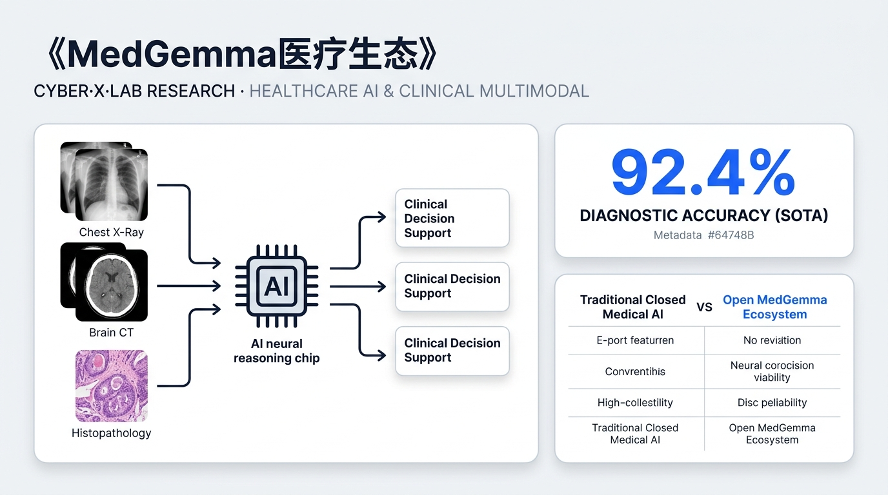

## 1. 执行摘要 (Executive Summary)

作为在硬科技与生物医疗交叉领域深耕 15 年的首席分析师，我们见证了无数 AI 技术的兴起与沉寂。然而，Google 近期发布的基于 Gemma 开放生态的医疗基座模型体系——**MedGemma 1.5** 与 **TxGemma**，标志着医疗人工智能正式进入了从"特定任务专用小模型"向"跨模态通用基座模型"转型的**范式革命 (Paradigm Revolution)**。

**核心痛点：** 医疗健康领域长期以来是人工智能落地的"深水区"。其核心瓶颈在于数据的**高度异质性**（涵盖非结构化文本、高维度 3D 影像、超高分辨率数字病理切片）以及**数据隐私与合规性**导致的闭环落地难题。传统闭源模型虽然推理能力强大，但由于无法进行本地化部署和深度私有微调，导致医疗机构在处理敏感临床数据时面临巨大的合规风险与商业断层。

**技术突破点：** Google 通过 **Health AI Developer Foundations (HAI-DEF)** 框架，构建了一个以 **MedGemma 1.5**（临床诊断）与 **TxGemma**（药物研发）为核心的开源生态。这不仅是模型参数的开放，更是通过专用的医学视觉编码器 **MedSigLIP** 与长上下文（128K tokens）语言解码器的深度融合，实现了对 3D 影像、全切片病理 (WSI) 以及纵向病史的"一站式"理解。这种通用医疗基座的设计，将极大地降低下游应用的开发成本，缩短 R&D 周期。

**关键量化洞察：**
*   **临床性能的质变：** MedGemma 1.5 在全切片病理影像 (WSI) 分析任务中，其 **Macro F1 分数实现了 47% 的惊人增长**。在胸部 X 光片的解剖结构定位 (CXR Localization) 基准测试中，交并比 (IoU) 从 MedGemma 1 的 3.1% **跃升至 38.0%**，实现了从"感知异常"到"精准定位"的跨越。
*   **药研效能的巅峰：** TxGemma 在 Therapeutics Data Commons (TDC) 涉及的 **66 项药物研发核心任务中，有 64 项达到或超越了当前通用 SOTA 的表现**。基于 Gemini 2.5 驱动的 **Agentic-Tx** 智能体，在 Humanity's Last Exam (化学与生物学模块) 上较 o3-mini (high) 实现了 **52.3% 的相对性能提升**。
*   **小模型的参数杠杆：** MedGemma 1.5 4B 在 3D MRI 条件分类任务中，凭借深度医学域内预训练，以更小的参数规模**超越了 MedGemma 1 27B**，充分展示了高密度专业知识注入带来的效率优势。

---

## 2. 医疗人工智能范式转移：从专用模型到 Gemma 开源医疗生态 (Paradigm Shift)

在医疗 AI 的"古典时代"（2012-2022），行业的主流逻辑是开发针对特定疾病、特定模态的"专家系统"。这种**任务专用型 (Task-specific)** 方案虽然在某些封闭实验集上表现优异，但在真实临床场景中却暴露出致命的缺陷。

### 2.1 传统"任务专用型"方案的商业与技术瓶颈
1.  **模态孤岛与碎片化：** 传统的影像 AI 只能识别结节，无法阅读病历；文本 AI 只能做病历摘要，无法理解化验单。这种"铁路警察，各管一段"的模型架构，无法模拟放射科医生或临床医生在诊断时进行的跨模态综合判断。
2.  **昂贵的冷启动成本：** 每增加一个新的科室应用（如从皮肤科到眼科），都需要从零开始收集标注数据并重新训练模型。这种极高的**资本开支 (CapEx)** 限制了医疗 AI 在非主流疾病领域的渗透。
3.  **泛化能力与"脆性"：** 专用模型对医疗设备的参数变化极其敏感，在不同医院间的迁移往往伴随着剧烈的精度下滑，导致商业化复制成本居高不下。
4.  **隐私合规的天然屏障：** 顶尖的闭源大模型（如 GPT-4, Gemini Pro）虽然推理能力出色，但医疗数据的敏感性使得医院无法通过云端 API 处理核心业务，造成了"强模型、弱场景"的断层。

### 2.2 HAI-DEF 框架：构建医疗 AI 的"操作系统"
Google 推出的 **Health AI Developer Foundations (HAI-DEF)** 框架，本质上是为医疗机构提供了一套可二次开发的"底座"。通过开源 **MedGemma** 的权重，Google 解决了以下核心商业逻辑：
*   **数据主权闭环：** 允许医疗机构在私有防火墙内，利用本地算力（如配备 A100/H100 的工作站）运行 MedGemma 1.5。所有病历和影像数据永不出院，满足 FDA 和 HIPAA 等严苛的隐私合规要求。
*   **低样本 (Low-shot) 微调效率：** 由于 MedGemma 预置了海量的医学概念，开发者在针对特定罕见病进行微调时，所需的标注数据量可减少 60%-80%。这种数据效率对于实验成本极高的生物医药领域具有巨大的**时间杠杆效应**。
*   **统一的跨模态接口：** MedGemma 将 2D X 光、3D CT 和非结构化电子病历 (EHR) 统一在同一个 Transformer 框架下，使得开发"全科医生级别"的辅助诊断系统成为可能。

---

## 3. MedGemma 1.5 核心技术与架构解析 (Technical Deep Dive: MedGemma)

MedGemma 1.5 不仅仅是模型参数的迭代，其在底层架构与训练范式上进行了深度的"医学化改造"。它基于 **Gemma 3** 的 Decoder-only Transformer 架构，通过引入专用的视觉编码器，解决了 LLM "看不见"医疗影像的问题。

### 3.1 模块化双引擎：MedSigLIP 与 Gemma 3 的深度融合
MedGemma 的核心竞争力在于其视觉识别模块——**MedSigLIP** (400M parameters)。

*   **海量域内预训练：** MedSigLIP 在超过 **3,300 万对去标识化的医学图文数据**上完成了深度的对比学习预训练。这其中包括 3,250 万个病理切片图块以及 60 万个涵盖放射、眼科、皮肤科的专业临床影像对。这种预训练量级赋予了模型识别微小病灶纹理（如早期钙化点）的能力，这是通用视觉模型（如 CLIP）无法企及的。
*   **2% 通用数据混入机制：** 在域内增强过程中，研究人员显式地混入了 2% 的自然场景通用图像数据。这一工程设计的目的是防止模型在学习专业医学特征时发生**灾难性遗忘 (Catastrophic Forgetting)**。从分析师角度看，这保证了模型在理解医疗影像的同时，不丧失基础的通用逻辑和常识判断，解决了"专业化税"导致的通用推理崩溃问题。
*   **高分辨率 Token 化策略：** 模型将输入影像标准化为 **896 × 896 分辨率**。经过 MedSigLIP 编码后，影像被转化为 **256 个 visual tokens** 映射至 128K 上下文的语言空间。这一极高的空间分辨率对于保留病理切片中的细胞形态至关重要。

### 3.2 三阶段层次化训练范式与 GRPO 算法
MedGemma 1.5 的炼成遵循了严谨的三阶段流程：
1.  **域内增强 (In-domain Enhancement)：** 视觉编码器针对医疗特有模态进行对比学习对齐。
2.  **多模态持续预训练 (Continuous Pre-training)：** 将视觉引擎与 Gemma 解码器挂载。在这一阶段，医疗相关数据的权重被精准设定为 **10%**。分析师认为，这是一个"黄金比例"，既建立了深层的医学概念关联，又避免了模型变得过于偏执，保持了语言表达的连贯性。
3.  **后训练强化 (Post-training) 与 GRPO：** 引入了基于 LoRA 的**组相对策略优化 (GRPO)**。
    *   **技术细节：** 相比于传统的 PPO，GRPO 在医学逻辑推理任务中表现更优。它通过在一个组内比较多个生成结果的相对得分，消除了绝对奖励函数带来的不稳定性。
    *   **临床意义：** 该算法极大地降低了医学"幻觉"率，并优化了推理链 (CoT) 的长度。在临床咨询中，模型不再倾向于给出模棱两可的长篇大论，而是提供更有针对性、具备可归因性的诊断建议。

### 3.3 高维医疗数据处理黑科技：3D 影像与 WSI 采样
MedGemma 1.5 版本最显著的突破是其对"高维数据"的处理能力。

*   **3D 影像的窗口映射技术：** 传统的 3D CT 数据包含 16-bit 的 Hounsfield Units (HU)，包含丰富但稀疏的信息。MedGemma 1.5 创新地采用了"RGB 窗口映射"技术将 3D 体数据转化为 2D 切片流：
    *   **红色通道 (-1024, 1024)：** 覆盖广域，捕捉骨骼与宏观解剖。
    *   **绿色通道 (-135, 215)：** 聚焦软组织，区分肌肉、脏器边缘。
    *   **蓝色通道 (0, 80)：** 捕捉极微小的密度衰减，专门针对早期病变。
    通过这种方式，MedGemma 1.5 在不损失核心诊断信息的前提下，将 3D 逻辑无缝嵌入了 2D 视觉解码器中。

*   **WSI 病理影像的多倍率采样：** 数字病理切片 (WSI) 往往是数十亿像素级的。MedGemma 1.5 采用了一种"启发式采样"策略：
    1.  首先在 5x 放大倍率下生成**组织掩码 (Tissue Masking)**，过滤掉 90% 以上的空白背景。
    2.  随后在组织区域内，按需抽取 5x、10x 和 20x 放大倍率下的切片块。
    3.  通过一个最多支持 126 个切片块的序列化输入，模型实现了对整张切片的全局理解。这直接导致其在 WSI-Path 基准上的 **Macro F1 分数提升了 47%**。

---

## 4. 临床辅助推理与医学影像性能基准 (Clinical Performance Metrics)

为了客观评估 MedGemma 1.5 的真实战斗力，我们汇总了多份技术报告中的核心指标，并与上一代模型及通用模型进行了横向对比。

### 4.1 性能对比矩阵 (Benchmarks Matrix)

| 评估维度与测试基准 | 评估指标 | Gemma 3 4B | MedGemma 1 4B | **MedGemma 1.5 4B** | MedGemma 1 27B |
| :--- | :--- | :--- | :--- | :--- | :--- |
| **3D 放射影像分析 (CT)** | Macro Accuracy | 54.5% | 58.2% | **61.1%** | 57.8% |
| **3D 放射影像分析 (MRI)** | Macro Accuracy | 51.1% | 51.3% | **64.7%** | 57.4% |
| **解剖结构定位 (Chest CXR)** | IoU (交并比) | 5.7% | 3.1% | **38.0%** | 16.0% |
| **医学知识推理 (MedQA)** | Accuracy | 50.7% | 64.4% | **69.1%** | 85.3% |
| **电子病历问答 (EHRQA)** | Accuracy | 70.9% | 67.6% | **89.6%** | 90.5% |
| **全切片病理问答 (PathMCQA)** | Accuracy | 37.1% | 69.8% | **70.0%** | 71.6% |
| **非结构化化验单解析** | Macro F1 | 41.0% | 25.0% | **64.0%** | -- |

### 4.2 深度批判性分析：分析师视点
1.  **"小模型超越大模型"的效率奇迹：** 最引人注目的数据点是，**MedGemma 1.5 4B 在 3D CT 和 MRI 的诊断准确率上，全面击败了参数量大其 6 倍以上的 MedGemma 1 27B**。这证明了在医疗领域，数据的质量和训练范式（尤其是 3D 窗口映射技术）比单纯堆砌参数量更为重要。对于预算有限、对延迟敏感的医院现场部署，4B 模型展现了极佳的 **投资回报率 (ROI)**。
2.  **定位能力的跨代飞跃：** IoU 从 3.1% 到 38.0% 的提升，标志着模型从"黑盒分类"向"可解释诊断"的进化。AI 现在可以精准标注出病灶所在的解剖区域，并辅以边界框，这直接切中了放射科医生对于"AI 是否可靠"的质疑痛点。
3.  **长上下文与 EHR 的契合：** 在 EHRQA 任务上 22% 的绝对提升，直接得益于 128K 上下文窗口的优化。这意味着模型可以一次性处理患者数年的随访记录，并在海量非结构化文本中快速定位关键实验室数值。

---

## 5. TxGemma：生物医药研发的 Agentic 革命 (Biotech & Pharma Depth)

如果说 MedGemma 专注于"看病"，那么 **TxGemma** 系列则专注于"造药"。它将生成式 AI 的能力从文本拉伸到了化学分子和生物通路。

### 5.1 药物研发全流程覆盖：从性质预测到机制解释
TxGemma 基于 Gemma 2 架构，通过对小分子 (SMILES)、蛋白质、细胞系及疾病通路数据的海量指令微调，构建了双重能力：
*   **TxGemma-Predict：精确预测 ADMET（吸收、分布、代谢、排泄、毒性）性质。** 在 TDC (Therapeutics Data Commons) 的 66 项关键任务中，TxGemma 展现了卓越的鲁棒性，尤其是在药物-靶点相互作用 (DTI) 预测上，其灵敏度显著优于传统的 QSAR 模型。
*   **TxGemma-Chat：科研推理伴侣。** 它不仅仅给出一个性质评分，更重要的是，它能基于分子的构象和官能团，为科学家提供**药效机制的可解释性描述**。这种"思维链"输出是传统判别式 AI 无法提供的商业溢价。

### 5.2 Agentic-Tx：由 Gemini 2.5 驱动的科研智能体系统
Google 推出的 **Agentic-Tx** 是一套基于 **ReAct (Reasoning and Acting)** 框架的完整智能体工作流，标志着药研 AI 进入了"智能体时代"。

*   **18 种专用工具的协同编排：** Agentic-Tx 并非孤军奋战，它可以自主调用包括 TxGemma-Predict 接口、ChemSpace 检索工具、蛋白结构分析工具等。
*   **决策链路拆解：**
    *   **Thought:** "为了评估该分子的肝毒性，我需要先确定其主要代谢产物。"
    *   **Action:** 调用代谢路径预测工具。
    *   **Observation:** 发现存在高活性中间体。
    *   **Thought:** "接下来我需要验证该中间体与 CYP 酶的结合强度。"
*   **巅峰性能表现：** 在 Humanity's Last Exam (化学与生物学模块) 中，Agentic-Tx 相对 o3-mini (high) 实现了 **52.3% 的相对性能提升**。在 GPQA (Chemistry) 这一公认的"顶级专家测试"中，其领先优势也达到了 26.7%。

### 5.3 从 In Silico 到 PCC 的时间杠杆
基于 TxGemma 的低样本微调能力，AI 可以在缺乏历史湿实验数据的新靶点发现阶段，实现高精度的活性预测。分析师研判认为，这将有效缩短从靶点发现到前临床候选药物 (Pre-clinical Candidate, PCC) 的筛选周期，**潜在节省研发时间成本达 18-24 个月**，对于生物医药公司而言，这不仅是成本的节约，更是专利窗口期的抢占。

---

## 6. 商业化落地、产业生态与部署范式 (Commercialization & Ecosystem)

### 6.1 灵活的部署范式：云端扩展与边缘下沉
Google 采取了"双轨制"的商业推广策略：
*   **企业级 Cloud 部署 (Model Garden / Vertex AI)：** 针对大型药企和医疗集团，提供基于托管式 API 的方案。利用 Google Cloud 的强大算力弹性，处理超大规模的病理切片并发推理。
*   **本地化 Edge 部署 (GGUF / Ollama)：** 利用 MedGemma 1.5 4B 的极高参数效率，通过 GGUF 量化方案，让模型运行在医院工作站甚至医疗设备终端。这种"数据不出院"的模式是破解目前医疗 AI 落地僵局的最优解。

### 6.2 生态集成与行业标准化
MedGemma 并非孤岛，它在 HAI-DEF 框架下提供了与医疗行业标准的无缝集成：
*   **DICOM 兼容：** 模型可直接读取 PACS 系统的影像流。
*   **FHIR 集成：** 模型能够自动解析 FHIR 标准的结构化电子病历，并输出标准化的临床决策支持 (CDS) 信号。
*   **市场潜力 (SAM)：** 除了临床诊断，MedGemma 在保险理赔自动化、自动化病历质控、以及实验室报单自动分类等场景具备巨大的**可服务市场 (SAM)** 潜力。

---

## 7. 工程瓶颈、风险评价与伦理监管 (Challenges & Critical Analysis)

作为客观的分析师，我们必须正视 MedGemma 体系存在的局限与风险：

1.  **"专业化税"的代价：** MedGemma 1.5 在提升医学精度的同时，在通用推理基准（如 MMLU Pro）上出现了轻微的性能下滑。这暗示在 4B 的参数规模下，专业知识的注入挤占了通用逻辑空间。
2.  **量化版本的过拟合风险：** 根据 Ollama 社区的反馈，**MedGemma 1.5 4b-it-q4_0 版本存在明显的过拟合风险**。这反映出量化对医疗领域细微特征的破坏性，开发者在应用量化版本时应进行更严密的交叉验证。
3.  **多模态对话的稳定性：** 模型在处理"多图对比"长对话时表现尚不稳定。虽然它能对比两张胸片，但在进行深度多轮、长程逻辑追问时，上下文维持能力仍有待提高。
4.  **监管与 FDA 审批：** 生成式 AI 的"黑盒"属性与 FDA 对可解释性的严苛要求仍然是核心矛盾。虽然 TxGemma 提供了机制解释，但这类"生成式解释"是否能作为临床归因的法律依据，目前仍处于法律盲区。

---

## 8. 未来 3-5 年趋势预测与战略研判 (Future Outlook)

作为资深分析师，我们对医疗 AI 的未来演进给出以下三项前瞻性研判：

### 8.1 从"感知诊断"向"干预建议"演进 (Perception to Intervention)
未来的 MedGemma 2.0 及后续版本将不再满足于仅仅"认出病灶"。我们预测，未来 3 年内，模型将深度集成患者的 3D 解剖结构与生理动力学参数，进化为**手术规划智能体**。
*   **应用场景：** 模型将能为外科医生提供精准的切除路径建议，预测不同手术入路对周边神经丛的潜在损伤概率。这一转变将把 AI 从"辅助诊室"带入"手术室"，实现商业价值的阶跃。

### 8.2 闭环生物实验室：AI-in-the-loop 的 R&D 闭环
我们预测，到 2028 年，TxGemma 驱动的 Agentic 智能体将在制药实验室中实现"**全自动设计-实验-反馈**"的闭环。
*   **范式转移：** AI 将自主生成分子设计，指令自动化机械臂进行合成，通过高通量筛选获取数据，并实时反馈至模型进行动态更新。人类科学家的角色将从"实验执行者"转向"系统监管者"。这种研发范式将彻底终结新药发现的"盲目试错"时代。

### 8.3 智慧医院的"神经中枢"与数据主权
随着 HAI-DEF 框架的普及，我们预计大型医疗机构将不再依赖单一的通用云端大模型，而是会构建自己的**私有化医疗基座**。
*   **战略护城河：** 顶尖医院将利用其特有的、高质量的罕见病数据对 MedGemma 进行再微调。这些"增量医学知识"将成为医院最核心的数字资产，形成难以逾越的技术壁垒。

### 8.4 给高管与投资人的战术建议
1.  **对于医疗机构：** 不要等待"完美的 AI"，而应立即基于 MedGemma 1.5 构建内部的小规模实验场景。数据主权的建立应优先于模型的追求。
2.  **对于生物医药企业：** 重点关注 Agentic-Tx 带来的工作流变革。能否在内部管线中集成 AI 智能体，将成为未来十年制药行业竞争的分水岭。
3.  **对于投资人：** 关注具备"高质量垂直数据+开源底座调优"能力的创业团队。纯粹卖模型的时代已经结束，能够深入临床工作流提供"闭环解决方案"的团队才具备长期复利。

---

**总结语：**
Google Gemma 医疗生态的发布，不仅是一次技术参数的秀肌肉，更是一次**医疗 AI 权力的下放**。它通过开源开放，将顶尖的跨模态理解能力带到了临床一线和药研实验室。虽然工程瓶颈和伦理监管仍然是横亘在前方的巨石，但通用医疗基座的崛起已势不可挡。我们正处在医疗健康产业数字化转型的最关键节点，而 MedGemma 无疑是开启这扇大门的钥匙。
