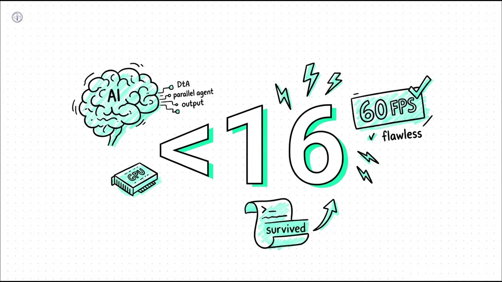
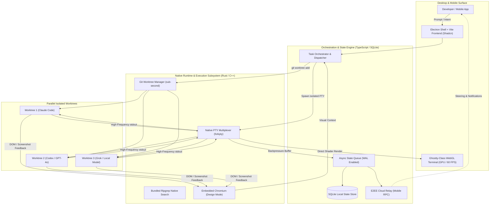

## 1. Executive Summary

### Architectural Paradigm Synthesis: Defining the ADE
The modern software engineering landscape is undergoing a tectonic shift, moving from human-authored code assisted by AI to agent-orchestrated systems where humans act as high-level architects and reviewers. Orca is not a traditional Integrated Development Environment (IDE); it is the world’s first purpose-built **Agent Development Environment (ADE)**. While legacy editors like VS Code or JetBrains were designed as optimized text editors for a single human operator, Orca is architected as a high-concurrency orchestrator for a "fleet" of parallel AI agents. This distinction is fundamental: Orca treats agents as first-class citizens, providing them with the necessary filesystem isolation, process autonomy, and multimodal feedback loops they require to function without human micro-management.

### The Core Engineering Pain Point: The "Single-Cursor Bottleneck"
Legacy IDEs suffer from what we define as the **Single-Cursor Bottleneck**. In a traditional environment, there is only one active workspace, one active branch, and one primary cursor. When a developer introduces an AI agent into this environment, the agent must compete for the same resources. If an agent attempts to run a test suite while the developer is refactoring a component, file locks, state conflicts, and terminal interference become inevitable. This "stop-and-start" workflow prevents engineering teams from realizing the true potential of AI. Parallelism in legacy IDEs is a retrofitted afterthought; in Orca, it is the foundational premise.

### The Disruptive Underlying Mechanism: Parallel Git Worktree Isolation
The technical breakthrough that enables Orca to bypass the single-cursor bottleneck is the transition from branch-based development to **Parallel Git Worktree Isolation**. Leveraging native Git primitives, Orca allows for the instantiation of multiple, isolated filesystem workspaces that share the same underlying `.git` object store. This means a developer can "fan out" a single prompt across five different agents, each operating in its own sub-second instantiated worktree, without the overhead of cloning the repository or the cognitive load of constant `git stash` and `git checkout` cycles.

### Representative Real-World Workflow: The 100x Builder Journey
Consider a scenario where a systems engineer needs to implement a complex, breaking change—such as migrating an entire authentication layer from JWT to OIDC while maintaining 100% test coverage. In Orca, the engineer provides the objective once. The ADE then spawns five parallel worktrees. Each worktree hosts a different agent—perhaps **Claude Code**, **Codex**, **Grok**, **Gemini**, and a local **Pi** instance. As these agents work concurrently, the engineer monitors the live terminal stdout via a high-performance **Ghostty-class WebGL pipeline** and receives real-time notifications on a mobile companion app. The engineer then uses Orca’s **Annotate AI Diffs** to provide feedback, eventually merging the winning implementation and discarding the others.

---

## 2. System Philosophy & The Paradigm Shift

### The Transition from Human-Centric to Agent-First
Traditional IDEs were built for a person typing at ~40 words per minute. Agents operate at the speed of API inference and local compute, often generating thousands of lines of code and terminal output in seconds. Orca’s architecture is **Agent-First**, meaning it is designed to ingest, process, and display this high-velocity data without lag. The system recognizes that an agent is not just a "smarter autocomplete," but a semi-autonomous worker that needs its own "desk" (worktree), its own "eyes" (Chromium Design Mode), and its own "hands" (Computer Use capabilities).

### Core Architectural Design Principles

#### Isolation by Default
Orca utilizes native OS mechanisms to ensure that no two agents can interfere with each other’s environment. Each agent is encapsulated within its own process tree and filesystem boundaries. This prevents "pollution" of the developer’s primary workspace. If an agent accidentally executes a destructive command or fails a build, the blast radius is confined to its specific worktree.

#### Parallelism as a First-Class Citizen
The architecture eliminates the sequential nature of software development. By moving away from "stashing" and "branch juggling," Orca enables high-concurrency engineering. This philosophy extends to the UI, which supports infinite terminal splits and a unified dashboard for tracking the progress of an entire fleet of agents simultaneously.

#### Compute Allocation Models: Hybrid Local and Remote
Orca maintains a lightweight, high-performance GUI built on **Electron** and **Vite** for local interactions. However, it is designed to offload heavy computational workloads—such as massive parallel indexing or complex test runs—to remote SSH compute runtimes. The `orca serve` daemon allows a developer to connect a "beefy remote box" to their local MacBook or mobile device, creating a seamless bridge between local ergonomics and cloud-scale compute.

### Design Trade-offs: Resource Management vs. Throughput
Running multiple parallel worktrees and terminal sessions significantly increases the demand on system resources—specifically NVMe I/O, RAM, and GPU cycles. Orca manages this through:
*   **Sub-second instantiation:** Using Git worktrees instead of full clones minimizes disk footprint.
*   **GPU-accelerated rendering:** Offloading terminal display to the GPU via WebGL ensures the CPU remains available for agent processes.
*   **Asynchronous State Management:** Utilizing a robust SQLite backend with Write-Ahead Logging (WAL) to ensure that the high frequency of agent updates does not lock the UI thread.

---

## 3. Deep Dive: Core System Architecture & Mechanisms

### System Topology & Data Flow
The Orca event loop is a sophisticated orchestration of user input, agent execution, and state persistence. When a prompt is initiated, the **Orchestration Layer** (located in `src/`) evaluates the request and determines the required resources. It then communicates with the **Native Layer** (`native/`) to spawn a new Git worktree and a pseudo-terminal (PTY) session.



Data flows through the following pipeline:
1.  **Input:** User or API-driven prompt.
2.  **Scheduling:** Orchestration of agent lifecycle and worktree allocation.
3.  **Execution:** Native `forkpty` creates an isolated terminal session for the agent.
4.  **Feedback:** The agent utilizes **Chromium Design Mode** to "see" the UI and **Native Search** (ripgrep) to index the codebase.
5.  **Persistence:** All terminal history, agent thoughts, and file changes are streamed to a local **SQLite** database via an asynchronous queue.

### Component Topology & IPC Model

#### The Electron Shell & Vite Frontend
The frontend is a high-density TypeScript application that manages the complex UI requirements of an ADE. It utilizes **Vite** for fast hot-module replacement and **Shadcn** components for a modern, developer-centric interface. The Electron shell acts as the bridge between the web-based UI and the underlying operating system.

#### Native Bindings (Rust/C++)
The performance-critical sections of Orca are implemented in the `native/` directory. This includes:
*   **PTY Management:** High-fidelity pseudo-terminal handling for seamless agent-CLI interaction.
*   **Filesystem Watchers:** Real-time synchronization of file changes across multiple worktrees.
*   **Native Search Integration:** Bundled **ripgrep** binaries for sub-second searching across massive monorepos, even over SSH.

#### IPC & RPC Communication
Orca employs a strictly typed IPC (Inter-Process Communication) model between the Electron main process and renderer. For remote and mobile connectivity, it utilizes a specialized **E2EE Cloud Relay** (found in `cloud/`). This relay allows for pairing mobile companions with desktop hosts using an end-to-end encrypted protocol, ensuring that sensitive source code and API keys never touch a central server in plain text.

### Concurrency & Isolation Model: The Worktree Deep Dive
The use of `git worktree` is the cornerstone of Orca’s concurrency model. Unlike a standard `git checkout`, which changes the files in your current directory, `git worktree add` creates a new directory linked to the same repository. This allows Orca to:
*   **Avoid Zero-Copy Overhead:** Multiple agents work on different branches simultaneously without duplicating the heavy `.git` folder.
*   **Enable Parallel Testing:** A developer can run the test suite for `feature-a` in one worktree while an agent refactors `feature-b` in another.
*   **Maintain Workspace Integrity:** Your primary "human" workspace remains untouched while the agents operate in their assigned directories.

### Real-Time Communication & Persistence

#### SQLite Asynchronous Queue & WAL
To handle the "firehose" of data generated by 5+ parallel agents, Orca implements a **Write-Ahead Logging (WAL)** mechanism in its SQLite persistence layer. This allows for concurrent reads and writes, ensuring that even if an agent is flooding the terminal with megabytes of logs, the GUI remains responsive. This background write-ahead logging is a critical fix for the "GUI lag" common in early AI-integrated editors.

#### E2EE Cloud Relay & Mobile RPC
The `cloud/` workspace manages a secure relay for the mobile companion app (available on iOS and Android). This system uses an RPC (Remote Procedure Call) mechanism to stream agent status updates, usage metrics, and terminal output to the developer's phone. This allows engineers to "steer" their agents—approving diffs or sending follow-up prompts—while away from their workstations.

### Rendering & UI Breakthroughs

#### Ghostty-class WebGL Pipeline
Traditional terminal components like `xterm.js` can become a bottleneck when rendering high-frequency stdout from multiple agents. Orca uses a **Ghostty-class WebGL rendering engine** that leverages the GPU. This ensures a consistent **60 FPS** (sub-16ms frame latency) and supports features like infinite scrollback and persistent terminal sessions that survive app restarts.

#### Chromium Design Mode: The Multimodal Bridge
Frontend agents often fail because they cannot "see" the visual output of their code. Orca’s **Design Mode** instantiates a real Chromium window for every worktree. Agents can:
*   **Click UI elements:** Via the `orca click` command.
*   **Fill forms:** Via the `orca fill` command.
*   **Visual Feedback:** The ADE captures **cropped screenshots** and extracts **HTML/CSS** directly from the live DOM, injecting this multimodal data into the agent's prompt context. This enables a true "visual-code-test" loop.

---

## 4. Security Model, Sandboxing & Blast Radius Mitigation

### Process & Filesystem Isolation
Orca treats every agent session as potentially untrusted. By enforcing isolation through separate PTYs and worktrees, the ADE ensures that a "rogue" agent command cannot easily escape the confines of its task. This filesystem-level sandboxing is the first line of defense against autonomous errors.

### Credential & Secret Protection
Managing API keys for 27+ different agents is a significant security challenge. Orca includes a secure vault with **passphrase caching**. This feature allows the ADE to manage authenticated SSH sessions and API requests without requiring the developer to repeatedly enter passwords, while still keeping the underlying secrets encrypted at rest.

### Network & IPC Safeguards
The communication between the ADE and external agents is strictly monitored. Orca implements defense-in-depth measures to prevent script injection via terminal output. Furthermore, Windows builds are **code-signed** via **SignPath.io** and the **SignPath Foundation**, ensuring the integrity of the binary and preventing unauthorized modifications.

---

## 5. Engineering Workflow Transformation & Multi-Agent Collaboration

### Legacy IDE vs. Agent-First Paradigm Matrix

| Feature | Legacy IDE (Cursor/VS Code) | Orca ADE |
| :--- | :--- | :--- |
| **Primary Workflow** | Sequential / Single-Cursor | Concurrent / Parallel Fleet |
| **Isolation Mechanism** | Manual Branching / Stashing | Native Git Worktrees (Isolated) |
| **Terminal Rendering** | CPU-based (Canvas/DOM) | GPU-accelerated (WebGL) |
| **Multimodal Feedback** | Chat-based screenshots | Native Chromium Design Mode |
| **Remote Runtimes** | Plugin-based SSH | Native `orca serve` Daemon |
| **Mobile Integration** | Notifications only | Full RPC / Agent Steering |
| **State Store** | Local filesystem / JSON | SQLite WAL (Asynchronous) |
| **Agent Driveability** | Limited | Full CLI Support (`orca click`, etc.) |

### Competitive Landscape & Architectural Decision Tree
Orca sits at the apex of the "AI Builder" stack. While Cursor and Copilot excel at inline completions and sidebar chatting, they are limited by their human-centric UI. Headless CLI agents are powerful but lack the visual context and review tools required for complex engineering. 

**When to use Orca:**
*   **The "Writer" Phase:** When you need to generate large amounts of code across multiple files or architectures.
*   **Parallel Exploration:** When you want to compare how different models (e.g., Claude vs. DeepSeek) approach the same refactor.
*   **Visual Engineering:** When the agent needs to interact with a live browser DOM.

**When NOT to use Orca:**
*   For trivial, single-line "hotfixes" where the overhead of a worktree is unnecessary.
*   On hardware with less than 16GB of RAM or non-SSD storage.

### The Multi-Agent "Fan-Out" Journey: A Step-by-Step
1.  **Objective Definition:** "Implement a responsive dashboard using Tailwind and Recharts with mock data."
2.  **Worktree Instantiation:** Orca executes `orca worktree create` across 3 environments.
3.  **Fleet Deployment:** 
    *   `wt-1`: **Claude Code** handles the layout logic.
    *   `wt-2`: **Codex** implements the chart components.
    *   `wt-3`: **Grok** writes the unit and E2E tests.
4.  **Parallel Execution:** All three worktrees run their own `pnpm dev` servers.
5.  **Multimodal Review:** The developer uses the **Mobile Companion** to check progress while away from the desk.
6.  **Conflict Review & Annotation:** The developer drops Markdown comments on the diffs. These annotations are "shipped back" to the agents for refinement.
7.  **Final Integration:** The developer merges the successful "writer" output into the `main` branch.

### Ergonomic CLI & Configuration: `orca.yaml`
The environment is highly configurable via the `orca.yaml` file, which allows teams to standardize their ADE setup.

```yaml
# Example orca.yaml Configuration
project: "cyberxlab-core"
agents:
  - id: "claude-max"
    model: "claude-3-5-sonnet"
    skills: ["frontend", "refactor"]
  - id: "codex-primary"
    model: "gpt-4o"
    skills: ["backend", "testing"]

worktrees:
  base_path: "./worktrees"
  auto_cleanup: true

rendering:
  backend: "webgl"
  fps_limit: 60

remote:
  host: "dev-server-01"
  port: 22
  user: "architect"
  path: "/home/architect/orca-workspace"
```

---

## 6. Domain-Specific Deep Dive

### Developer Experience (DX) & Ergonomic Architecture
The Orca repository is a masterclass in modular software design. The use of specialized directories like `skill-guides/` and `skill-stubs/` provides a structured way for agents to learn the specific nuances of a codebase. This modularity is enforced through a **pnpm-workspace** structure, ensuring that the `cloud/` relay logic remains decoupled from the `native/` OS bindings.

### Community Velocity & Ecosystem Health
Orca’s growth is a testament to its disruptive potential.
*   **80.8k GitHub Stars:** One of the fastest-growing developer tools in history.
*   **495+ Contributors:** A massive global community of systems engineers.
*   **960+ Releases:** A relentless "ship daily" cadence (964 releases to date).
*   **12,058 Commits:** Demonstrating deep, sustained engineering effort.

### Operational Footprint: Local vs. Remote
Orca is designed for versatility. On **macOS (Apple Silicon)**, it leverages the Neural Engine and Metal for rendering. On **Windows**, it includes specific fixes for **NTFS EPERM errors** on `userData` writes. For **Headless Linux**, the `orca serve` daemon is optimized for minimal idle CPU usage, focusing purely on PTY stability and SSH throughput.

---

## 7. Performance Benchmarks & Extensibility

### Quantified Performance Metrics
*   **Terminal Latency:** Target <16ms.
*   **Workspace Instantiation:** <800ms for massive monorepos using Git worktrees.
*   **Search Speed:** Bundled **ripgrep** allows for searching 100k+ files in <200ms.
*   **Memory Management:** Intelligent garbage collection for inactive worktree terminals.

### Extensibility & Protocol Support
Orca fully supports the **Model Context Protocol (MCP)**, allowing it to integrate with an ever-expanding registry of external tools. The **Custom Skills** architecture allows developers to define domain-specific hooks that agents can call, such as triggering a specialized CI pipeline or interacting with a proprietary database.

### Supported Agent Ecosystem
Orca supports over **27+ agents**, providing a unified interface for the entire AI landscape:
*   **Tier 1:** Claude Code, Codex, Grok, Gemini, GitHub Copilot.
*   **Specialized:** Muse, DeepSeek Harness, ZCode, OpenCode, Antigravity.
*   **Open Source/Community:** Pi, oh-my-pi, Hermes Agent, Goose, Auggie, Cline.
*   **Productivity:** Droid, Kilocode, Kimi, Kiro, Mistral Vibe, Qwen Code.

---

## 8. Production Readiness Scorecard & Real-World Gotchas

### Engineering Bottlenecks
*   **NVMe I/O Saturation:** Parallel indexing of five worktrees can strain even high-end SSDs. We recommend high-IOPS NVMe drives for optimal performance.
*   **Windows NTFS Locking:** Rapid file creation can sometimes trigger `EPERM` errors. Orca addresses this via **batch-file spawn failure mitigations** and optimized Electron write paths.

### Readiness Scorecard

| Metric | Rating | Engineering Note |
| :--- | :--- | :--- |
| **Deployment Complexity** | Low | Native installers (Brew, AUR, EXE) available. |
| **Resource Overhead** | Medium | Parallelism requires high RAM/GPU. |
| **Failure Recovery** | High | SQLite WAL ensures no data loss on crash. |
| **Agent Support** | Extreme | Supports any terminal-based CLI agent. |
| **Security** | High | Code-signed binaries and E2EE cloud relay. |

---

## 9. Quick-Start & Production Setup Playbook

### Prerequisites
*   **Hardware:** 16GB RAM (32GB recommended), Apple Silicon or modern Intel/AMD CPU.
*   **Software:** Node.js (pnpm), Git 2.34+ (for worktree support).

### 3-Step Minimal Walkthrough
1.  **Install:**
    ```bash
    # macOS
    brew install --cask stablyai/orca/orca
    # Arch Linux
    yay -S stably-orca-bin
    ```
2.  **Auth:** Connect your agent subscriptions (Anthropic, OpenAI, etc.).
3.  **Fan-out:** Open your project and run `orca worktree create` to start your first parallel session.

### Headless Linux Server Configuration
To turn a remote server into an Orca worker:
```bash
# On the remote server
orca serve --port 2222 --secure-token YOUR_TOKEN

# On your local Orca ADE
orca remote connect dev-server-01:2222
```

---

## 10. Future Evolution & Autonomous Engineering Roadmap

### Semantic Integration: Native LSP Support
The next frontier for Orca is the integration of **Language Server Protocol (LSP)** directly into the worktree orchestration layer. This will allow agents to perform deep semantic analysis across multiple parallel environments simultaneously.

### Multi-Agent Swarms
The long-term vision is a move toward **Autonomous Swarms**, where different agents take on specialized roles—one as a "Writer," one as a "Reviewer," and one as a "QA Engineer"—all collaborating within the Orca ADE to deliver production-ready code with minimal human intervention.

---

## 11. References & Project Links

*   **Publisher:** Cyber·X·Lab (cyberxlab.xyz)
*   **Project Home:** [onorca.dev](https://onorca.dev)
*   **Source Code:** [github.com/stablyai/orca](https://github.com/stablyai/orca)
*   **Corporate:** Stably AI (YC Backed, San Francisco)
*   **Contact:** Support (support@cyberxlab.xyz), Partnerships (bd@cyberxlab.xyz)
*   **License:** MIT (Stably AI © 2026)
