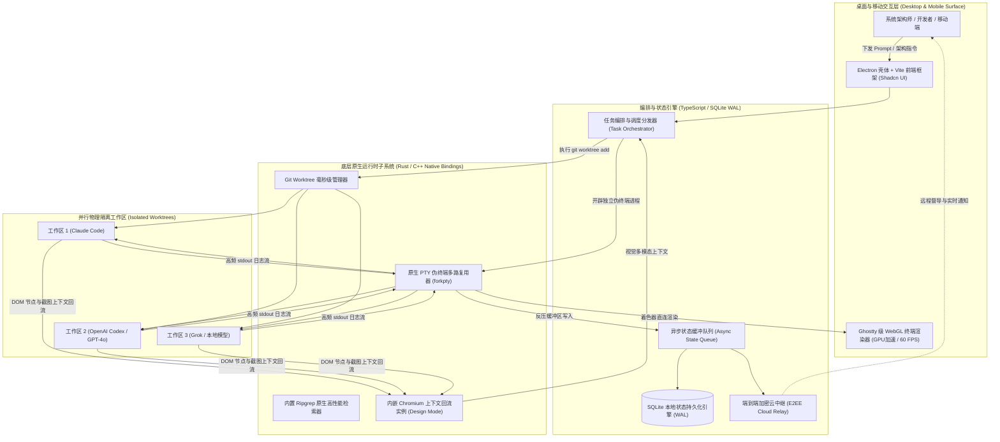

## 1. 核心摘要 (Executive Summary)

### 架构范式提炼：定义 ADE（智能体开发环境）
现代软件工程范式正经历一场地壳运动——从“人类手写代码、AI 辅助补全”加速演进为“以智能体协同编排为主体，人类负责顶层架构设计与代码审查”的全新形态。Orca 并非一款传统意义上的集成开发环境（IDE），而是业界首个专为 AI 编码原生设计的**智能体开发环境（Agent Development Environment, ADE）**。传统编辑器（如 VS Code 或 JetBrains）的底层假设是“单一物理键盘与单个由人类操控的光标”，而 Orca 则直接构建为面向并发“智能体舰队”（Agent Fleet）的高性能编排调度引擎。这一范式差异是根本性的：Orca 将 AI 智能体视为一等公民（First-Class Citizens），为其赋予独立物理文件系统沙箱、自主执行进程以及多模态即时反馈视窗，彻底终结了人类对智能体的微观托管与繁琐干预。

### 核心工程痛点：“单光标并发瓶颈”（The Single-Cursor Bottleneck）
传统 IDE 存在不可逾越的**单光标瓶颈**。在传统单分支工作区中，开发者只能处于单一激活分支并操作一个共享文件系统索引。当开发者尝试引入 AI 智能体执行高负荷任务（例如自动化重构某一模块）时，智能体必然与人类产生对底层资源的激烈争夺：智能体执行测试套件或重写文件时，会触发物理文件锁冲突、Git 暂存区污染以及终端输出阻塞，迫使工程师频繁执行 `git stash` 与分支切换。传统 IDE 中的“并发”只是打补丁式的侧边栏附件；而在 Orca 中，**高并发智能体编排是与生俱来的底层底座**。

### 颠覆性底层机制：基于 Git Worktree 的物理文件系统绝对隔离
Orca 突破单光标瓶颈的关键工程机制在于从单分支切换走向**原生 Git Worktree 物理隔离模型**。基于 Git 原生能力，Orca 能够毫秒级开辟出多个物理相互隔离但共享同一底层 `.git` 对象存储库的工作空间。这意味着工程师只需一次下发指令，系统即可瞬间“扇出（Fan-out）”至 5 个独立的智能体工作区，每个工作区均在子秒级实例化的独立目录中并行推进，既不产生冗余克隆开销，又彻底消除了分支污染与上下文冲突。

### 代表性实战工作流：100x 构建者的并行竞速之旅
以核心认证模块的技术重构为例（如将 JWT 无缝迁移至异步 OIDC 协议并维持 100% 测试覆盖）：在 Orca 中，系统架构师只需输入一次业务目标，ADE 即可并行拉起 5 个隔离的 Git Worktrees，分别挂载 **Claude Code**、**OpenAI Codex**、**Grok**、**Gemini** 与本地 **Pi** 实例。多模型并发执行时，架构师通过 **Ghostty 级 WebGL GPU 终端管线**实时审视高频日志，并可通过手机移动端（Mobile Companion）进行远程巡检与督导；随后利用 Orca 的 **AI Diff 标注工具**完成跨分支横向对比，择优合入最佳实现并秒级丢弃其余分支。

---

## 2. 系统定位与设计哲学 (System Philosophy & Paradigm Shift)

### 从以人为中心走向智能体原生 (Human-Centric to Agent-First)
传统 IDE 是为每分钟打字 40 词的人类生理极限设计的；而现代智能体基于 API 推理与本地算力，能在数秒内倾泻成千上万行代码与巨量终端日志。Orca 的架构是 **Agent-First 原生**的，其整个渲染与 I/O 管线专为高吞吐、零延迟吞吐设计。系统将智能体视为拥有独立工位（Worktree）、独立视窗（Chromium Design Mode）与独立操作能力（Computer Use）的准自主工程师。

### 核心架构设计原则

#### 默认物理隔离 (Isolation by Default)
Orca 深度调用操作系统原生进程与文件系统机制，确保任意两个智能体之间绝不发生状态交叉污染。每个智能体都被限制在专属的进程树与 Worktree 目录边界内。若某一智能体执行了非预期的高风险命令或编译崩溃，其爆炸半径（Blast Radius）将被完全锁死在该任务的工作区内，主干开发环境坚如磐石。

#### 并发作为一等公民 (Parallelism as a First-Class Citizen)
彻底摒弃串行开发的工程妥协。通过彻底解耦 Git Worktrees，Orca 实现了研发全流程的高并发编排。该设计理念亦贯穿于其 UI 交互层：支持无上限的终端分屏组合，并提供统一的智能体集群监控看板。

#### 算力分配模型：本地轻量 GUI 与远程 SSH 算力池混合编排
Orca 客户端采用基于 **Electron** 与 **Vite** 构建的高性能轻量 GUI 处理交互反馈，同时支持通过 `orca serve` 无头守护进程无缝对接远端高性能 Linux 算力池（如多卡服务器或高配 VPS）。开发者在 MacBook 或移动设备上即可透明调用远端算力，实现本地高人体工效与云端海量算力的完美平衡。

### 核心架构权衡：吞吐性能 vs 硬件开销
并发开辟多工作区与伪终端带来了对 NVMe I/O、内存及 GPU 的更高要求。Orca 的工程应对方案包括：
*   **子秒级工作区实例化**：共享 `.git` 对象，单工作区开辟耗时 <800ms，杜绝完整克隆的存储放大。
*   **GPU 硬件加速渲染**：利用 WebGL 着色器卸载终端文本绘制，释放 CPU 资源专供智能体编译执行。
*   **异步持久化流处理**：SQLite WAL（预写日志）模式驱动高频并发状态落盘，保障 UI 主线程永不卡顿。

---

## 3. 底层架构与核心机制深度拆解 (Deep Dive: Architecture & Mechanisms)

### 端到端数据流与架构拓扑图



数据流转核心链路：
1.  **指令输入**：架构师或自动化 API 下发并发任务 Prompt。
2.  **编排调度**：Orchestration Layer 评估资源并调度对应的智能体生命周期。
3.  **原生隔离**：底层通过 `forkpty` 绑定独立伪终端，同时基于 `git worktree` 开辟独立物理目录。
4.  **闭环反馈**：智能体通过 **Chromium Design Mode** 获取实时视觉 DOM，借助内置 **ripgrep** 实现微秒级代码检索。
5.  **高可用持久化**：终端历史、推理思考链及文件变更经由反压队列异步写入 **SQLite WAL** 引擎。

### 组件拓扑与 IPC 通信模型

#### Electron 壳体与 Vite 前端体系
前端基于现代 TypeScript 与 Vite 构建，采用 Shadcn 设计体系呈现高信息密度的专业开发者视图，主进程与渲染进程间通过强类型 IPC 进行指令交互。

#### 原生扩展层 (Rust/C++ Native Bindings)
核心性能瓶颈由 `native/` 原生扩展承载：
*   **PTY 进程管理**：实现高保真伪终端操作，保障智能体 CLI 交互的稳健性。
*   **文件系统高频监听**：多工作区下高并发文件变动的实时同步与无锁状态监听。
*   **原生检索集成**：内嵌预编译 **ripgrep** 二进制包，保障超大 Monorepo 在本地及 SSH 远程环境下的极速符号检索。

#### 端到端加密云中继与移动端 RPC
在 `cloud/` 模块中实现了端到端加密（E2EE）中继协议，开发者手机端与宿主机之间的状态同步及指令下发均经过端到端密钥加密，敏感源代码与 API 密钥绝不向第三方中继服务暴露明文。

### 并发与工作区物理隔离：Git Worktree 深度解析
`git worktree` 是 Orca 并发模型的核心基石。不同于传统的 `git checkout` 破坏性修改当前工作区，Orca 在底层执行：
`git worktree add ../orca-worktrees/[task-id] [branch-name]`
*   **零拷贝对象复用**：多个工作区分支共享同一个 `.git` 底层对象库，不产生冗余存储。
*   **并行验证无干扰**：分支 A 进行压力测试的同时，分支 B 可并行执行大规模重构。
*   **工作空间绝对整洁**：主干开发环境不受实验性智能体调度的任何波及。

### 渲染流水线与 UI 突破：Ghostty 级 WebGL 终端
传统基于 DOM 或 Canvas 的终端组件（如早期 xterm.js）在多智能体高速输出时极易发生帧率骤降。Orca 集成了 **Ghostty 级 WebGL 终端引擎**，完全由 GPU 着色器接管字符渲染，在高密度分屏与高频输出下稳定维持 **60 FPS**（帧延迟 <16ms），并支持跨重启会话持久化与无限滚动回溯。

### 内嵌 Chromium 与 Design Mode 视觉反馈
前端智能体开发以往受限于“无法感知视觉呈现”的黑盒状态。Orca 为每个工作区配备内嵌 Chromium 视口，支持：
1.  开发者或 Agent 在视口中点击 UI 组件（`orca click`）。
2.  系统自动提取对应元素的 **实时 HTML 片段** 与 **计算后 CSS 样式**。
3.  自动抓取 **元素局部截图** 并打包回填至智能体 Prompt 上下文中。
该闭环将传统仅能处理纯文本的智能体转化为具备真实视力（Visually-Aware）的全栈前端工程师。

---

## 4. 安全架构、沙箱隔离与爆炸半径控制 (Security & Sandboxing)

### 进程与文件系统物理边界
Orca 严格遵循“最小信任原则”，每个智能体任务均被限制在独立的 PTY 进程与独立物理 Worktree 目录树内。即使智能体在推理中产生幻觉并执行了破坏性操作（如递归删除文件或安装冲突依赖），其损害范围也被严格锁死在当前工作区内，无法穿透至主干代码库或开发者本地根目录。

### 凭据保护与密码学金库 (Credential Protection)
针对同时调度 27+ 款不同模型与服务产生的 Key 管理痛点，Orca 内置轻量化密钥金库并支持 **Passphrase 缓存机制**，既避免了跨会话频繁重复输入凭据，又保障了本地密钥静态存储时的 AES 高强度加密。

### 网络与终端注入安全防线
Orca 对终端 stdout 数据流实施深层转义防御，防止利用转义序列或控制字符实施的任意脚本注入。同时，Windows 平台构建采用 **SignPath.io** 官方机构签名证书，确保分发二进制文件的完整性与供应链安全。

---

## 5. 工程实战与选型决策树 (Engineering Workflow & Decision Tree)

### 传统 IDE vs 智能体开发环境 (ADE) 核心维度对比矩阵

| 架构维度 | 传统 IDE / 插件侧边栏 (Cursor / VS Code) | Orca 智能体开发环境 (ADE) |
| :--- | :--- | :--- |
| **执行模型** | 串行单光标 / 人类轮询等待 | **高并发智能体集群并行编排** |
| **隔离机制** | 共享工作区 / 手工 Stash 切换 | **原生 Git Worktree 物理级隔离** |
| **终端渲染管线** | CPU 软件绘制 (Canvas / DOM) | **Ghostty 级 WebGL 着色器硬件加速 (GPU)** |
| **多模态视觉反馈** | 依赖手工外挂截图上传对话框 | **内嵌 Chromium Design Mode 实时 DOM 回流** |
| **算力扩展架构** | 依赖插件级 SSH 端口映射 | **原生 `orca serve` 高性能无头守护进程** |
| **移动端协同** | 仅支持被动告警推送 | **全功能 RPC 远程督导与代码审查合流** |
| **状态持久化** | 扁平 JSON / LocalStorage | **SQLite WAL 异步队列与抗崩溃回溯** |
| **智能体驱动支持** | 仅限人类键盘输入交互 | **全套原生 CLI 驱动 (`orca click`, `orca fill`)** |

### 竞品生态位与架构选型决策树 (Architectural Decision Tree)

```
                            [研发任务发起]
                                  │
                 是否需要多智能体并发竞速 / 跨架构全栈重构？
                                ╱       ╲
                             [是]       [否]
                              │           │
                 代码库处于 Git 版本控制？   单文件快速微调 / 单行 Hotfix？
                    ╱           ╲                 │
                 [是]           [否]         [选择 Cursor / VS Code]
                  │               │
         物理磁盘为 NVMe SSD 且   [传统无头 CLI 脚本]
         可用内存 >= 16GB？
              ╱       ╲
           [是]       [否]
            │           │
      [选择 Orca ADE]   [启用 `orca serve` 远端算力卸载]
```

#### ✅ 何时必须选用 Orca ADE：
1. **多模型方案竞速（Fan-out Exploration）**：需要对比 Claude Code、Codex 与 DeepSeek 等对同一复杂重构命题的实现优劣。
2. **全栈原型快速构建**：前端、后端、测试套件三线并行推进，各工作区独立启动 dev server。
3. **视觉多模态调试**：需要智能体根据实际渲染 DOM 和截屏精准定位并修复 CSS/布局缺陷。

#### ❌ 何时不建议使用 Orca ADE：
1. 单行语法修复或微小配置调整（Worktree 开辟的边际收益小于直接单点编辑）。
2. 在内存小于 16GB 或机械硬盘（HDD）的低配硬件上并发运行 5+ 工作区。

### 生产级配置样例：`orca.yaml`

```yaml
# Orca ADE 生产级工程配置文件范例
project: "cyberxlab-core"
version: "1.0.0"

# 智能体舰队调度配置
agents:
  - id: "claude-code-lead"
    model: "claude-3-5-sonnet-20241022"
    runtime: "native"
    skills: ["frontend", "refactor", "design-mode"]
  - id: "codex-backend"
    model: "gpt-4o"
    runtime: "native"
    skills: ["backend", "testing", "db-migration"]
  - id: "grok-optim"
    model: "grok-beta"
    runtime: "native"
    skills: ["perf-benchmarks", "concurrency"]

# Git Worktree 隔离策略
worktrees:
  base_path: "./.orca/worktrees"
  auto_cleanup_on_merge: true
  submodule_sync: false

# 终端与着色器渲染引擎
rendering:
  backend: "webgl"
  fps_limit: 60
  scrollback_lines: 50000

# 远程算力节点扩展
remote:
  enabled: true
  host: "gpu-cluster-01.internal.cyberxlab.xyz"
  port: 2222
  user: "devrel"
  identity_file: "~/.ssh/id_ed25519"
```

---

## 6. 垂直领域深度拆解：开发者体验与生态治理 (Domain Deep Dive)

### 开发者体验 (DX) 与模块化解耦
Orca 采用现代 pnpm-workspace monorepo 架构，将 `cloud/`（加密中继）、`native/`（操作系统底层绑定）与 `skill-guides/`（智能体业务技能引导规范）彻底解耦，为智能体提供了自解释、自学习的代码基座。

### 开源社区活力与生态健康度
*   **80,800+ GitHub Stars**：展现出极高的开源关注度与开发者共鸣。
*   **495+ 核心代码贡献者**：活跃的全球底层系统与工具链开发者生态。
*   **964 次持续发版**：保持近乎日更的敏捷迭代频次。
*   **12,058 次代码提交**：沉淀了深厚的底层工程工程化积累。
*   **宽松开源协议**：采用标准 MIT 开源许可证，对商业集成与二次开发高度友好。

---

## 7. 性能基准、扩展性与智能体生态矩阵 (Benchmarks & Ecosystem)

### 量化性能指标
*   **终端着色器刷新延迟**：稳定维持在 **<16ms**（满足 60 FPS 严苛要求）。
*   **Worktree 工作区实例化**：单次创建耗时 **<800ms**。
*   **Monorepo 符号检索**：内置 ripgrep 驱动，10 万级代码文件检索响应 **<200ms**。

### 协议支持与 27+ 智能体生态覆盖
Orca 深度集成 Anthropic 推出的 **Model Context Protocol (MCP)**，支持将自定义企业内部 API 或数据源以标准化接口暴露给智能体。同时内置支持横跨 4 大梯队的 **27+ 款** 终端与云端智能体：
*   **旗舰 Tier 1**：Claude Code, OpenAI Codex, Grok, Gemini CLI, GitHub Copilot.
*   **专业与前沿**：Muse, DeepSeek Harness, ZCode, OpenCode, Antigravity.
*   **开源与社区**：Pi, oh-my-pi, Hermes Agent, Goose, Auggie, Cline.
*   **效能生产力**：Droid, Kilocode, Kimi, Kiro, Mistral Vibe, Qwen Code.

---

## 8. 生产就绪度评分卡与实战避坑 (Production Readiness Scorecard & Gotchas)

### 真实生产环境工程瓶颈
*   **NVMe I/O 承压**：当 5 个智能体同时触发大型依赖安装（如 `pnpm install`）或编译时，磁盘随机写入吞吐会达到峰值，建议配备高 IOPS 的 PCIe 4.0/5.0 NVMe 固态硬盘。
*   **Windows NTFS 句柄锁**：由于 Windows 文件系统对处于打开状态的句柄存在强锁定机制，频繁创建/删除文件可能偶发 `EPERM`，需依赖 Orca 内置的重试缓冲机制规避。

### 生产落地自检评分卡 (Scorecard)

| 评估维度 | 就绪度评级 | 架构师实战说明 |
| :--- | :---: | :--- |
| **部署与交付复杂度** | 🟢 **优秀 (Low)** | 全平台支持包管理器一键安装（Brew、AUR、Windows EXE）。 |
| **硬件资源开销** | 🟡 **中等 (Medium)** | 并发运行多智能体与 WebGL 对本地内存（>=16GB）与 GPU 有一定门槛要求。 |
| **崩溃恢复与数据韧性** | 🟢 **优秀 (High)** | SQLite WAL 机制确保终端崩溃或异常断电后工作区状态可完整复原。 |
| **智能体兼容广度** | 🟢 **极致 (Extreme)** | 凡具备 CLI/终端交互能力的智能体均可即插即用挂载。 |
| **企业级安全合规** | 🟢 **优秀 (High)** | 官方认证签名二进制文件、端到端加密手机中继、无中央明文代码存储。 |

---

## 9. 极简上手与落地部署指南 (Quick Start Playbook)

### 环境基线要求
*   **硬件要求**：推荐 16GB 统一内存（32GB 最佳），Apple Silicon 或现代 x86_64 处理器，NVMe 固态硬盘。
*   **前置依赖**：Git 2.34+（确保原生 Worktree 完善支持）、Node.js (pnpm)。

### 三步极简上手
```bash
# 1. 安装客户端
# macOS (Homebrew)
brew install --cask stablyai/orca/orca

# Arch Linux (AUR)
yay -S stably-orca-bin

# 2. 授权认证智能体凭据
orca auth login --provider anthropic

# 3. 开启首个并发工作区
cd your-project-dir
orca worktree create --agent claude-code --name "feat-auth-refactor"
```

### 远端 Linux 无头守护进程配置
在计算服务器部署无头服务并将本地 ADE 连入：
```bash
# 远程 Linux 服务器执行
orca serve --port 2222 --secure-token YOUR_ENCRYPTED_TOKEN

# 本地 Orca ADE 控制台绑定
orca remote connect gpu-server-01.internal:2222 --token YOUR_ENCRYPTED_TOKEN
```

---

## 10. 演进路线与自主软件工程未来 (Roadmap & Autonomous Future)

### 原生语言服务器 (LSP) 深度集成
Orca 下一阶段核心攻坚目标是将 **Language Server Protocol (LSP)** 直接注入到 Worktree 编排层，赋予智能体集群跨越分支、跨工作区进行全局类型安全推导与语义感知的能力。

### 自主智能体蜂群 (Autonomous Agent Swarms)
长期愿景是演进为由架构师统一指挥的**自治研发蜂群**：由分析智能体拆解需求，架构智能体设计协议，多名编写智能体并行竞速编码，审查智能体自动比对 Diff 并运行端到端测试，最终形成全自动合流的高阶自主研发流水线。

---

## 11. 相关资源与项目链接 (References & Links)

* 🏢 **出品方**：Cyber·X·Lab（数字生命与智能体系统实验室，[cyberxlab.xyz](https://cyberxlab.xyz)）
* 🌐 **项目主页**：[onorca.dev](https://onorca.dev)
* 💻 **开源代码仓**：[github.com/stablyai/orca](https://github.com/stablyai/orca)
* 🏢 **商业背景**：Stably AI (YC Backed, San Francisco)
* 📬 **官方联络**：技术支持 (support@cyberxlab.xyz) · 商务合作 (bd@cyberxlab.xyz)
* 📄 **开源协议**：MIT License (Stably AI © 2026)
